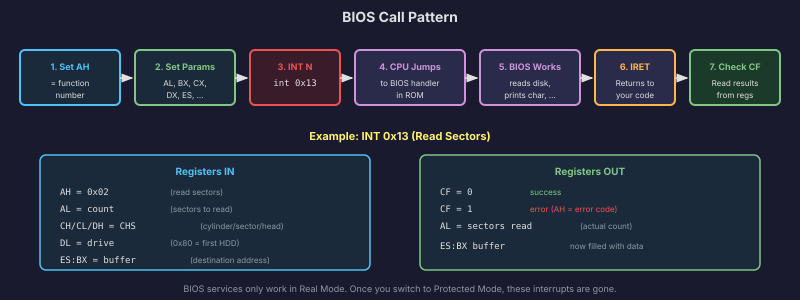
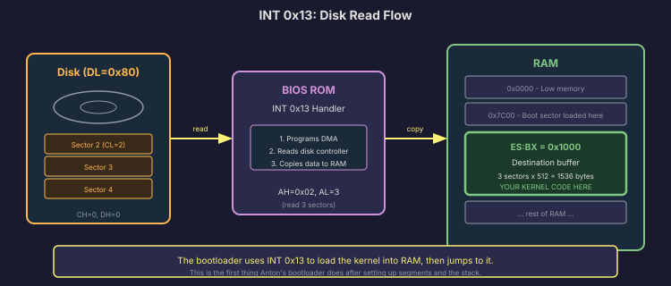
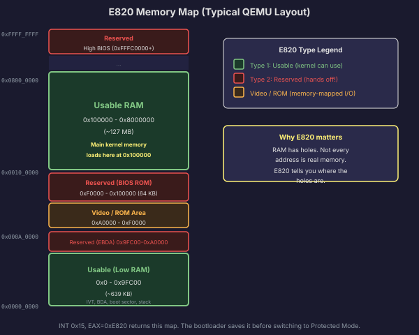
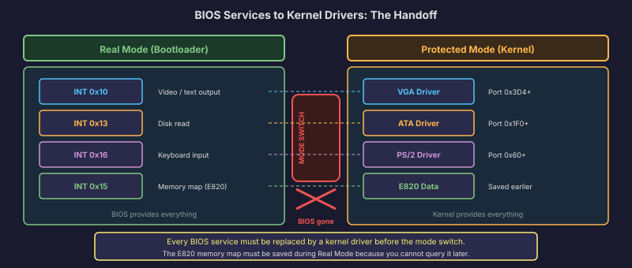

# x86 BIOS Services

When the computer first powers on, the operating system does not exist yet. There are no drivers for the screen, the keyboard, or the disk. But the bootloader needs to print messages, read keystrokes, and load the kernel from disk. How does it do any of that without drivers?

The answer is the **BIOS** (Basic Input/Output System). The BIOS is firmware, code burned into a chip on the motherboard that runs before anything else. It initializes the hardware, performs a basic self-test (the POST), and then provides a set of **services** that the bootloader can call through software interrupts. These services are simple, slow, and limited, but they work. They are the only hardware interface available until the operating system provides its own.

## How BIOS Services Work

BIOS services are invoked through the `INT` instruction with a specific vector number. Each vector provides a family of related functions. You select the specific function within a family by setting the `AH` register (and sometimes other registers) before executing the interrupt.

The general pattern is:

1. Set `AH` to the function number.
2. Set other registers with parameters specific to that function.
3. Execute `INT N` where N is the interrupt vector.
4. Read the results from the registers the BIOS returns them in.
5. Check the carry flag (`CF`) for errors.

All BIOS services operate in **16-bit real mode**. They use 16-bit registers and segment:offset addressing. This is important: you can only call BIOS services while the CPU is in real mode. Once you switch to protected mode, the BIOS is gone. The software interrupt vectors point to your IDT, not the BIOS interrupt vector table. The segment registers are selectors, not segment bases. BIOS code cannot run.

This means the bootloader has a window of opportunity. Everything it needs from the BIOS must be gathered before the switch to protected mode. After that, the kernel is on its own.



## INT 0x10: Video Services

The video BIOS provides functions for printing text, setting video modes, and manipulating the cursor. The function we care about most is **teletype output**.

### AH = 0x0E: Teletype Output

This is the simplest way to print a character to the screen. It handles scrolling, cursor advancement, and newlines automatically.

```
mov ah, 0x0E      ; teletype output function
mov al, 'A'       ; character to print
mov bh, 0x00      ; page number (0 for the default page)
int 0x10           ; call video BIOS
```

After this call, the letter "A" appears at the current cursor position, and the cursor advances one position to the right. If the cursor reaches the end of a line, it wraps to the next line. If it reaches the bottom of the screen, the screen scrolls up.

To print a string, you loop through each character:

```
print_string:
    mov ah, 0x0E
.loop:
    lodsb               ; load byte from [DS:SI] into AL, increment SI
    test al, al         ; is it the null terminator?
    jz .done
    int 0x10            ; print the character
    jmp .loop
.done:
    ret
```

This is the `print_string` function from our Hello World example. You will see it in every bootloader.

### AH = 0x00: Set Video Mode

```
mov ah, 0x00      ; set video mode function
mov al, 0x03      ; mode 0x03: 80x25 text mode, 16 colors
int 0x10
```

Mode `0x03` is the standard 80-column, 25-row text mode with 16 foreground and 16 background colors. This is the mode the bootloader starts in and the mode Anton's kernel will use for its text console. We explicitly set it during boot to ensure a clean, known state.

Other modes exist (graphics modes, higher resolutions), but for OS development, text mode `0x03` is where you start. We will switch to a graphics mode much later, in Phase 9, when we build the window manager.

## INT 0x13: Disk Services

The disk BIOS is how the bootloader loads the kernel from the disk into memory. The boot sector is only 512 bytes, which is not enough space for an entire kernel. So the bootloader's primary job is to read additional sectors from disk and load them to a known memory address.

### AH = 0x02: Read Sectors (CHS)

The original disk read function uses **Cylinder-Head-Sector** (CHS) addressing:

```
mov ah, 0x02      ; read sectors function
mov al, 10        ; number of sectors to read
mov ch, 0         ; cylinder number (0-based)
mov cl, 2         ; sector number (1-based! sector 1 is the boot sector)
mov dh, 0         ; head number (0-based)
mov dl, 0x80      ; drive number (0x80 = first hard disk, 0x00 = first floppy)
mov bx, 0x1000    ; destination: load to ES:BX = 0x0000:0x1000
int 0x13          ; call disk BIOS
jc disk_error     ; if carry flag set, the read failed
```

The parameters:

- `AL`: How many sectors to read (each sector is 512 bytes).
- `CH`: Cylinder number (the concentric track on the disk platter).
- `CL`: Sector number. **Sector numbering starts at 1, not 0.** Sector 1 is the boot sector itself. Sector 2 is the first sector after the boot sector.
- `DH`: Head number (which side of the platter).
- `DL`: Drive number. The BIOS passes the boot drive number in `DL` when it loads the boot sector. Save it.
- `ES:BX`: The memory address to load the data into. The segment register `ES` and offset `BX` combine to form the real mode physical address.

After the call, if the carry flag is clear, the read succeeded and `AL` contains the number of sectors actually read. If the carry flag is set, the read failed and `AH` contains an error code.



CHS addressing has limitations. It can only address disks up to about 8 GB. For larger disks, you need the extended read function.

### AH = 0x42: Extended Read (LBA)

The extended read function uses **Logical Block Addressing** (LBA), which treats the disk as a flat array of sectors numbered from 0:

```
mov ah, 0x42          ; extended read function
mov dl, 0x80          ; drive number
mov si, dap           ; pointer to the Disk Address Packet
int 0x13
jc disk_error

dap:
    db 0x10           ; size of this packet (16 bytes)
    db 0              ; reserved (always 0)
    dw 10             ; number of sectors to read
    dw 0x1000         ; offset of destination buffer
    dw 0x0000         ; segment of destination buffer
    dd 1              ; starting LBA (sector 1 = first sector after boot)
    dd 0              ; upper 32 bits of LBA (for disks > 2 TB)
```

Instead of cylinder/head/sector, you pass a **Disk Address Packet** (DAP) structure in memory. The DAP specifies the starting sector as a simple linear number and the destination as a segment:offset pair. This is cleaner and works with any disk size.

The bootloader should check whether the BIOS supports extended disk services (by calling `INT 0x13, AH=0x41` to test for extensions) and fall back to CHS if it does not. In practice, every modern BIOS and every emulator (including QEMU) supports LBA.

### Error Handling and Retries

Disk reads can fail. The BIOS returns an error code in `AH` when the carry flag is set. Common errors include a timeout (the disk was not ready), a CRC error (data corruption), or a sector not found.

The standard practice is to retry the read a few times before giving up. Some BIOSes require a disk reset (`INT 0x13, AH=0x00`) between retries:

```
mov cx, 3             ; retry count
.retry:
    push cx
    ; ... set up the read parameters ...
    mov ah, 0x02
    int 0x13
    pop cx
    jnc .success       ; no error, we are done
    mov ah, 0x00        ; reset disk
    int 0x13
    dec cx
    jnz .retry
    jmp disk_error      ; all retries failed
.success:
```

## INT 0x15, EAX = 0xE820: Memory Map Detection

This is the single most important BIOS call for the kernel. The **E820 memory map** tells the operating system exactly how much RAM is installed and which regions are available for use.

The machine's physical address space is not a uniform block of RAM. Some regions are reserved for the BIOS, some for memory-mapped hardware, some for ACPI tables that the OS should preserve. Without the memory map, the kernel has no way to know which physical addresses it can safely use for page frames.

### How E820 Works

The E820 function returns the memory map one entry at a time. You call it repeatedly, and each call returns one region descriptor. A continuation value in `EBX` tells the BIOS where it left off. When `EBX` returns as 0 (or the carry flag is set), the map is complete.

Each entry is a structure with:

| Offset | Size | Field |
|--------|------|-------|
| 0 | 8 bytes | Base address (64-bit) |
| 8 | 8 bytes | Length in bytes (64-bit) |
| 16 | 4 bytes | Type |

The type field indicates what the region is used for:

| Type | Meaning |
|------|---------|
| 1 | Usable RAM (the kernel can use this) |
| 2 | Reserved (do not touch) |
| 3 | ACPI Reclaimable (usable after the OS reads the ACPI tables) |
| 4 | ACPI NVS (non-volatile storage, do not touch) |
| 5 | Bad memory |

### The Calling Sequence

```
detect_memory:
    mov di, memory_map     ; ES:DI = destination buffer
    xor ebx, ebx          ; EBX = 0 (start of map)
    mov edx, 0x534D4150   ; EDX = 'SMAP' (magic signature)

.loop:
    mov eax, 0xE820       ; function number
    mov ecx, 24           ; buffer size (24 bytes per entry)
    int 0x15              ; call BIOS

    jc .done              ; carry set means end of map (or error)

    cmp eax, 0x534D4150   ; BIOS must return 'SMAP' in EAX
    jne .error

    add di, 24            ; advance buffer pointer to next entry
    test ebx, ebx         ; is EBX zero?
    jnz .loop             ; if not, there are more entries

.done:
    ; memory_map now contains the complete E820 map
    ret

.error:
    ; E820 not supported, handle gracefully
    ret
```

Let's walk through this:

1. Set `ES:DI` to point to a buffer where the entries will be stored.
2. Set `EBX` to 0 (tells the BIOS to start from the beginning).
3. Set `EDX` to the magic value `0x534D4150` (the ASCII string "SMAP" in little-endian).
4. Set `EAX` to `0xE820` (the function number) and `ECX` to 24 (the size of each entry buffer).
5. Call `INT 0x15`.
6. On return, `EAX` should be `0x534D4150` (the BIOS echoes the signature). `EBX` is a continuation value for the next call. `ECX` is the number of bytes written.
7. If `EBX` is not zero, call again to get the next entry.
8. If the carry flag is set or `EBX` is zero, the map is complete.

The bootloader stores this map at a known address and passes it to the kernel. The kernel's physical memory manager reads the map to determine which page frames are available for allocation.

In QEMU, a typical E820 map might look like:

```
Base: 0x0000000000000000  Length: 0x000000000009FC00  Type: 1 (Usable)
Base: 0x000000000009FC00  Length: 0x0000000000000400  Type: 2 (Reserved)
Base: 0x00000000000F0000  Length: 0x0000000000010000  Type: 2 (Reserved)
Base: 0x0000000000100000  Length: 0x0000000007F00000  Type: 1 (Usable)
Base: 0x00000000FFFC0000  Length: 0x0000000000040000  Type: 2 (Reserved)
```

The first usable region is conventional memory (below 640 KB). The second usable region starts at 1 MB (`0x100000`) and extends for 127 MB. This is where the kernel lives. The reserved regions are for the BIOS ROM, VGA memory, and other hardware.



## INT 0x16: Keyboard Services

The keyboard BIOS provides functions for reading keystrokes and checking the keyboard buffer.

### AH = 0x00: Wait for Keypress

```
mov ah, 0x00
int 0x16          ; wait until a key is pressed
; AH = scan code, AL = ASCII character
```

This function blocks until the user presses a key. It returns the scan code (a hardware code identifying which physical key was pressed) in `AH` and the ASCII character in `AL`. If the key has no ASCII representation (like a function key or arrow key), `AL` is 0.

This is useful for "Press any key to continue" prompts in the bootloader, or for a simple interactive menu.

### AH = 0x01: Check for Keypress (Non-Blocking)

```
mov ah, 0x01
int 0x16          ; check if a key is waiting
jz no_key         ; ZF set = no key available
; AH = scan code, AL = ASCII character (but key is NOT removed from buffer)
```

Unlike function `0x00`, this does not block. It checks whether a key is waiting in the keyboard buffer. If `ZF` is set, no key is available. If `ZF` is clear, a key is waiting, and you can read it with function `0x00`.

## Why BIOS Services Stop Working After Protected Mode

This is the most important thing to understand about BIOS services: **they are only available in real mode.** Once the bootloader switches to protected mode, every BIOS service disappears.

Here is why. BIOS service routines are 16-bit code that lives in the BIOS ROM (mapped at the top of the first megabyte of address space). They were written for real mode, using real mode segment:offset addressing and the real mode interrupt vector table (IVT).

When you switch to protected mode:

1. **The interrupt vector table is replaced.** In real mode, the IVT is an array of segment:offset pairs starting at address `0x0000`. In protected mode, the CPU uses the IDT (Interrupt Descriptor Table), which you set up yourself. The old BIOS interrupt handlers are no longer reachable through `INT N`.

2. **Segment registers change meaning.** In real mode, `DS = 0x0000` means the data segment starts at physical address `0x0000`. In protected mode, `DS` is a selector into the GDT, and its meaning depends on the GDT entry. The BIOS code assumes real mode segmentation and would produce nonsensical addresses.

3. **16-bit code cannot run in 32-bit mode.** The same opcode byte can have different meanings in 16-bit and 32-bit mode. Running 16-bit BIOS code while the CPU is in 32-bit mode would decode instructions incorrectly.

This has a concrete consequence for the bootloader's design: **everything the kernel needs from the BIOS must be gathered before the switch to protected mode.** Specifically:

- **The memory map** (E820) must be collected and stored where the kernel can find it.
- **The boot drive number** must be saved (the BIOS passes it in `DL`).
- **Any status messages** must be printed (because after protected mode, you need your own screen driver).
- **The kernel binary** must be loaded from disk into memory.

After the switch, the kernel replaces every BIOS service with its own driver: a VGA text driver for the screen, a PS/2 driver for the keyboard, an ATA/AHCI driver for disk access, and the E820 data for memory management.



## Wrapping Up Chapter 3

Let's look at where we are. We started this chapter by understanding why assembly is necessary: the boot sequence requires it, performance-critical kernel paths demand it, and certain hardware operations have no C equivalent. We learned NASM syntax: directives, data definitions, labels, macros, and the special symbols that make bootloader padding work.

We wrote complete assembly programs: a Hello World that prints to the screen via BIOS, loops and conditionals, function calls with the full cdecl protocol, and cross-language calls between C and assembly. We learned GCC's inline assembly syntax and built the practical helper functions (`outb`, `inb`, `cli`, `sti`, `hlt`, `read_cr0`, `write_cr3`) that will form the kernel's hardware abstraction layer.

Finally, we cataloged the BIOS services the bootloader will use: video output (`INT 0x10`), disk reads (`INT 0x13`), memory map detection (`INT 0x15, E820`), and keyboard input (`INT 0x16`), and we understood why all of them become unavailable the moment we enter protected mode.

You now know enough assembly to read and write the code that Anton needs. In Chapter 4, we will learn the language that the vast majority of the kernel is written in: C.
