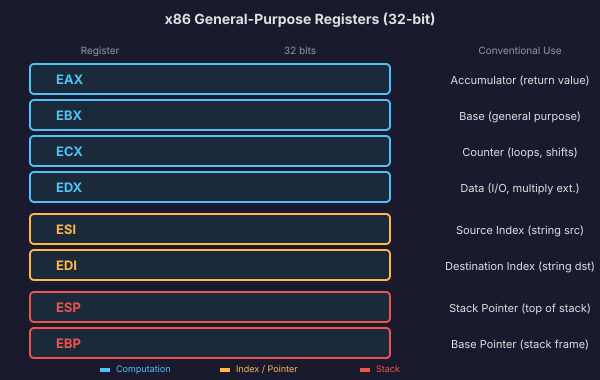
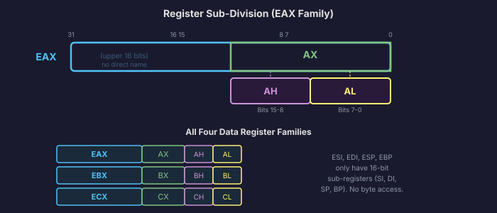
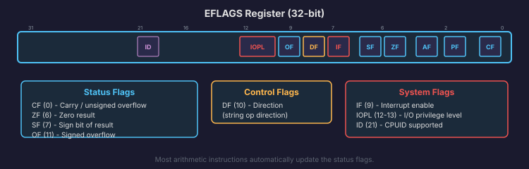
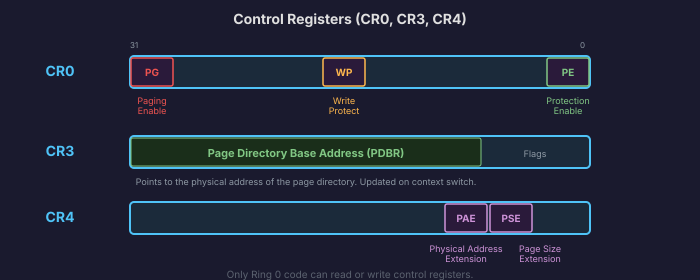

# CPU Registers: The Scratch Pad

In Chapter 1, we talked about the memory hierarchy: registers at the top, then caches, then RAM, then disk. We said registers are the fastest storage in the entire system, living inside the CPU itself, with access times measured in fractions of a nanosecond.

Now it is time to meet the actual registers. Not abstract boxes in a diagram. The specific, named registers that you will use in every piece of assembly code and that the C compiler targets when it generates machine code for Anton.

Think of registers as the CPU's workbench. RAM is the warehouse across the street. The CPU can only do work (add, compare, shift, test) on values that are sitting on the workbench. To work with a value from RAM, the CPU first loads it into a register, does its work, and then stores the result back. Every computation flows through registers.

## General-Purpose Registers

The 32-bit x86 processor has eight **general-purpose registers**. The word "general-purpose" is a bit misleading, because several of them have conventional roles that you should almost never violate. But electrically, any of them can hold any 32-bit value.

Here they are:

| Register | Conventional Role |
|----------|-------------------|
| `EAX` | **Accumulator**. Used for return values from functions, results of multiplication and division, and general computation. |
| `EBX` | **Base**. Often used as a pointer to data. Preserved across function calls (callee-saved). |
| `ECX` | **Counter**. Used as a loop counter by the `LOOP` instruction, and as the count for string operations with the `REP` prefix. |
| `EDX` | **Data**. Paired with `EAX` for multiplication and division (which produce 64-bit results). Also used for I/O port numbers with `IN`/`OUT`. |
| `ESI` | **Source Index**. Points to the source in string/memory copy operations (`MOVS`, `LODS`). |
| `EDI` | **Destination Index**. Points to the destination in string/memory operations (`MOVS`, `STOS`). |
| `ESP` | **Stack Pointer**. Always points to the top of the stack. Manipulated by `PUSH`, `POP`, `CALL`, `RET`. Do not use this for general computation unless you know exactly what you are doing. |
| `EBP` | **Base Pointer** (Frame Pointer). Points to the base of the current stack frame. Used to access function arguments and local variables at fixed offsets. |

These names come from the original 8086 era when each register had a more specific purpose. Modern code treats most of them as interchangeable (except `ESP` and `EBP`), but the conventional roles still matter because calling conventions and CPU instructions expect them.



## Sub-Registers: Looking Inside

Here is where x86 history shows through in a useful way. Each 32-bit general-purpose register is not just a 32-bit box. It contains smaller registers nested inside it, like Russian dolls.

Take `EAX` as the example:

- `EAX` is the full 32-bit register (bits 31 through 0).
- `AX` is the lower 16 bits of `EAX` (bits 15 through 0).
- `AH` is the upper 8 bits of `AX` (bits 15 through 8).
- `AL` is the lower 8 bits of `AX` (bits 7 through 0).

```
EAX (32 bits)
|-------------------------------|
|  upper 16 bits  |     AX      |
|                 |  AH  |  AL  |
|  bits 31-16     | 15-8 | 7-0  |
```

When you write to `AL`, you change bits 0 through 7 of `EAX` without affecting the upper 24 bits. When you write to `AX`, you change bits 0 through 15 without affecting the upper 16 bits. But when you write to `EAX`, you replace all 32 bits.

The same pattern applies to `EBX` (`BX`, `BH`, `BL`), `ECX` (`CX`, `CH`, `CL`), and `EDX` (`DX`, `DH`, `DL`).

The remaining four registers (`ESI`, `EDI`, `ESP`, `EBP`) have 16-bit sub-registers (`SI`, `DI`, `SP`, `BP`) but no 8-bit sub-registers. This is another artifact of the 8086 design.

Why does this matter? Because when you are writing a bootloader in 16-bit real mode, you use `AX`, `BX`, `CX`, `DX`. When you switch to 32-bit protected mode, you start using `EAX`, `EBX`, `ECX`, `EDX`. And when reading bytes from I/O ports or working with character data, you will frequently use `AL` and `AH` to handle individual bytes. The sub-register system is not a curiosity. You will use it constantly.



## Segment Registers

x86 has six **segment registers**: `CS`, `DS`, `ES`, `FS`, `GS`, and `SS`. These are 16-bit registers that serve very different purposes depending on which mode the CPU is in.

**In real mode** (where the bootloader runs), segment registers hold the upper part of a memory address. The physical address is calculated as `segment * 16 + offset`. For example, if `DS` is `0x0700` and you access `[0x1234]`, the physical address is `0x0700 * 16 + 0x1234 = 0x08234`. This segmented addressing scheme is how the original 8086 accessed 1 MB of memory with only 16-bit registers. We will cover this in detail in the next section.

**In protected mode** (where the kernel runs), segment registers no longer hold raw memory addresses. Instead, they hold **selectors**: indices into a data structure called the **Global Descriptor Table** (GDT). Each entry in the GDT describes a segment of memory with a base address, a size limit, and access permissions. The CPU uses the selector to look up the segment descriptor, which tells it the base address and what operations are allowed.

In practice, modern operating systems (including Anton) set up a **flat memory model**: every segment has a base of 0 and a limit of 4 GB, so the segmentation effectively does nothing. The GDT still needs to exist (the CPU requires it in protected mode), but it is configured to be transparent. The real memory management happens through paging, which we will set up in Phase 3.

Here is what each segment register is used for:

| Register | Purpose |
|----------|---------|
| `CS` | **Code Segment**. Points to the segment containing the currently executing code. The CPU uses this to fetch instructions. Also encodes the current privilege level (ring 0 or ring 3). |
| `DS` | **Data Segment**. Default segment for most data accesses. When you write `MOV EAX, [0x1000]`, the CPU uses `DS` as the segment. |
| `SS` | **Stack Segment**. Used for stack operations (`PUSH`, `POP`, and any access relative to `ESP` or `EBP`). |
| `ES` | **Extra Segment**. Used as the destination segment for string operations (`MOVS`, `STOS`). |
| `FS`, `GS` | **Additional segments**. No fixed purpose. Operating systems often use `FS` or `GS` to point to per-CPU or per-thread data structures. Linux uses `GS` for this in kernel mode. |

You cannot write to `CS` directly with a `MOV` instruction. The only way to change `CS` is through a far jump (`JMP FAR`), a far call, or an interrupt return (`IRET`). This is a safety feature: `CS` encodes the current privilege level, and the CPU needs to control transitions between privilege levels.

## The Instruction Pointer

The **instruction pointer** (`EIP` in 32-bit mode, `RIP` in 64-bit mode) holds the address of the next instruction the CPU will execute. We covered this in Chapter 1 as the core of the fetch-decode-execute cycle.

What makes `EIP` unusual among registers is that you cannot read or write it directly. There is no `MOV EAX, EIP` instruction and no `MOV EIP, EAX`. The instruction pointer is modified implicitly by:

- **Normal execution**: `EIP` advances by the size of the current instruction after each cycle.
- **Jump instructions**: `JMP`, `JE`, `JNE`, and all other conditional jumps set `EIP` to a new address.
- **Call and return**: `CALL` pushes the current `EIP` onto the stack and sets `EIP` to the function's address. `RET` pops the saved address back into `EIP`.
- **Interrupts and exceptions**: The CPU saves `EIP` on the stack and loads the handler's address from the Interrupt Descriptor Table.

Despite being invisible to direct manipulation, `EIP` is the single most important piece of CPU state. It is the thread of execution. When we implement multitasking in Phase 5, "switching between processes" means saving one process's `EIP` (along with its other registers) and loading another's.

## The FLAGS Register

The **FLAGS register** (called `EFLAGS` in 32-bit mode) is a 32-bit register where each bit is an independent flag that records information about the CPU's state or controls its behavior. You rarely work with `EFLAGS` as a whole. Instead, you care about individual flags.

The flags you will encounter most often in OS development:

### Status Flags (set by arithmetic and logic instructions)

| Flag | Bit | Name | Meaning |
|------|-----|------|---------|
| `ZF` | 6 | Zero Flag | Set to 1 if the result of the last operation was zero. |
| `CF` | 0 | Carry Flag | Set to 1 if the last operation produced a carry out of the most significant bit (unsigned overflow). |
| `OF` | 11 | Overflow Flag | Set to 1 if the last operation produced a signed overflow (result does not fit in the destination). |
| `SF` | 7 | Sign Flag | Set to 1 if the result of the last operation was negative (most significant bit is 1). |

### Control Flags

| Flag | Bit | Name | Meaning |
|------|-----|------|---------|
| `DF` | 10 | Direction Flag | Controls the direction of string operations. If clear, `ESI`/`EDI` increment. If set, they decrement. |
| `IF` | 9 | Interrupt Flag | If set, the CPU accepts hardware interrupts. If clear, hardware interrupts are masked. `CLI` clears it, `STI` sets it. |

### System Flags

| Flag | Bit | Name | Meaning |
|------|-----|------|---------|
| `IOPL` | 12-13 | I/O Privilege Level | A 2-bit field specifying the minimum ring level required to execute I/O instructions. |
| `NT` | 14 | Nested Task | Used for hardware task switching (rarely used in modern OSes). |

### How Flags Drive Conditional Execution

Here is where flags become practical. The `CMP` instruction compares two values by subtracting one from the other and setting the flags based on the result, without storing the result anywhere.

```
CMP EAX, 5
```

This computes `EAX - 5` and sets the flags:
- If `EAX` was 5, the result is 0, so `ZF` is set.
- If `EAX` was less than 5 (unsigned), the subtraction borrows, so `CF` is set.
- If `EAX` was less than 5 (signed), `SF` and `OF` are set appropriately.

Immediately after `CMP`, you use a conditional jump that reads the flags:

- `JE` (Jump if Equal): jumps if `ZF` is set.
- `JNE` (Jump if Not Equal): jumps if `ZF` is clear.
- `JL` (Jump if Less, signed): jumps if `SF != OF`.
- `JG` (Jump if Greater, signed): jumps if `ZF` is clear and `SF == OF`.
- `JB` (Jump if Below, unsigned): jumps if `CF` is set.
- `JA` (Jump if Above, unsigned): jumps if `CF` and `ZF` are both clear.

The `TEST` instruction works similarly but uses AND instead of subtraction. `TEST EAX, EAX` is a common idiom for checking whether `EAX` is zero: it ANDs the register with itself (which does not change it) and sets `ZF` if the result is zero.

This pattern of "compare or test, then conditional jump" is how all decision-making works at the CPU level. Every `if` statement, every `while` loop, every `switch` case in your C code compiles down to some variation of `CMP`/`TEST` followed by `Jcc`.



## Control Registers

Beyond the general-purpose and flags registers, x86 has a set of **control registers** that govern the CPU's operating mode. These are privileged: only ring 0 (kernel) code can read or write them. User-space programs that try to access a control register trigger a General Protection Fault.

The three you will use in Anton:

**`CR0`** controls fundamental CPU features:
- Bit 0 (`PE`, Protection Enable): Setting this bit switches the CPU from real mode to protected mode. We flip this bit in the bootloader.
- Bit 31 (`PG`, Paging): Setting this bit enables the paging unit. We flip this bit when setting up virtual memory in Phase 3.
- Bit 16 (`WP`, Write Protect): When set, prevents ring 0 code from writing to read-only pages. Important for copy-on-write and security.

**`CR3`** holds the physical address of the **page directory** (the top-level page table). When the CPU translates a virtual address to a physical address, it starts by reading the page directory pointed to by `CR3`. Changing `CR3` switches the entire virtual address space, which is how context switching between processes works.

**`CR4`** enables various CPU extensions:
- Bit 5 (`PAE`, Physical Address Extension): Allows 32-bit systems to address more than 4 GB of physical memory using 36-bit physical addresses.
- Bit 4 (`PSE`, Page Size Extension): Enables 4 MB pages in addition to the standard 4 KB pages.

We will come back to these registers in detail when we build the GDT (Phase 1), enable paging (Phase 3), and implement process switching (Phase 5). For now, just know they exist and that they are the switches that turn on the CPU's major features.



## Debug and Performance Registers

x86 also has **debug registers** (`DR0` through `DR7`) that let you set hardware breakpoints: the CPU can be told "stop when you access this specific address." This is how debuggers implement breakpoints without modifying your code.

There are also **model-specific registers** (MSRs), accessed through the `RDMSR` and `WRMSR` instructions. These control everything from performance counters to the `SYSCALL`/`SYSRET` mechanism. We will use MSRs later when setting up fast system calls.

These are advanced topics we will return to as needed. For now, the important registers are the eight general-purpose registers, the six segment registers, `EIP`, `EFLAGS`, and the three control registers (`CR0`, `CR3`, `CR4`). Together, they are the complete state of the CPU. When we save and restore a process's state during a context switch, these are the values we save.

In the next section, we will look at how the CPU uses these registers to access memory: the addressing modes that translate register values and constants into the specific memory locations your code reads and writes.
