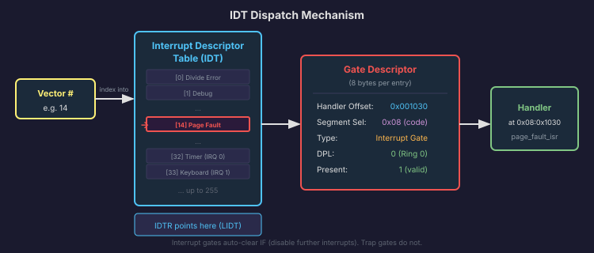
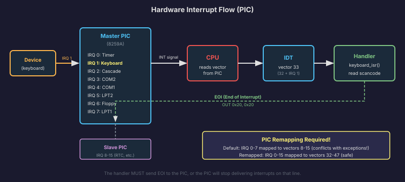
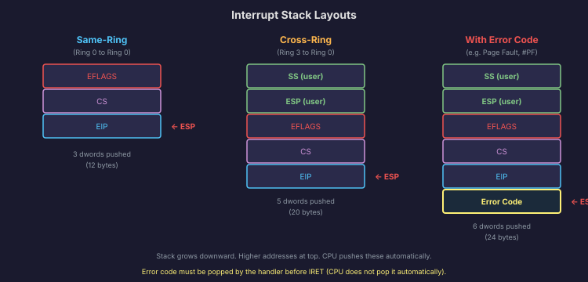

# CPU Exceptions and Interrupts

The fetch-decode-execute cycle is the CPU's steady heartbeat: fetch an instruction, decode it, execute it, advance the instruction pointer, repeat. But what happens when something goes wrong? What if the instruction divides by zero? What if it accesses an invalid memory address? And what happens when a hardware device needs attention, like a key being pressed on the keyboard?

The answer to all of these is the **interrupt and exception mechanism**. It is the CPU's way of saying "stop what you are doing and handle this." Understanding how it works is one of the most important things you will learn for OS development, because the kernel's entire relationship with hardware and with error handling is built on top of it.

## The Key Distinction

**Exceptions** are **synchronous**. They are caused by the instruction the CPU is currently executing. If the CPU divides by zero, it generates an exception right then and there. The exception is a direct consequence of the instruction. If you reran the same instruction with the same state, you would get the same exception.

**Interrupts** are **asynchronous**. They are caused by external hardware events that have nothing to do with the instruction being executed. The keyboard controller sends an interrupt when a key is pressed. The timer sends an interrupt when its countdown expires. The disk controller sends an interrupt when a read operation finishes. These events happen at unpredictable times, and the CPU must stop what it is doing to handle them.

Despite this fundamental difference, the CPU handles both through the same mechanism: it looks up a handler in the **Interrupt Descriptor Table** (IDT) and jumps to it. From the handler's perspective, the mechanics are the same. The difference is in what triggered the lookup.

## The Interrupt Descriptor Table

The **IDT** is an array of up to 256 entries, one for each possible interrupt or exception vector (numbered 0 through 255). Each entry is called a **gate descriptor** and contains:

- The address of the handler function (the code to execute when this vector fires).
- The segment selector for the handler (which GDT entry to use, typically the kernel code segment).
- The type (interrupt gate or trap gate, which differ in whether they automatically disable further interrupts).
- The DPL (Descriptor Privilege Level): what ring is allowed to trigger this vector via a software `INT` instruction.

The CPU locates the IDT using the `IDTR` register, which holds the base address and size of the table. You load it with the `LIDT` instruction during kernel initialization.

When vector N fires (whether from an exception, a hardware interrupt, or a software `INT N`), the CPU:

1. Reads entry N from the IDT.
2. Checks that the caller has sufficient privilege (for software interrupts, the CPL must be less than or equal to the gate's DPL).
3. If transitioning from ring 3 to ring 0, switches to the kernel stack (loaded from the TSS).
4. Pushes `EFLAGS`, `CS`, and `EIP` onto the (kernel) stack. If the exception pushes an error code, that goes on top.
5. If this is an interrupt gate, clears the `IF` flag in `EFLAGS` (disabling further hardware interrupts).
6. Loads the handler's `CS` and `EIP` from the IDT entry and begins executing.

The handler does its work and returns using `IRET`, which pops `EIP`, `CS`, and `EFLAGS` (and, if returning to ring 3, `ESP` and `SS`), restoring the CPU to the state it was in before the interrupt.



## CPU Exceptions (Vectors 0 through 31)

Intel reserves vectors 0 through 31 for CPU exceptions. These are defined by the architecture and cannot be reassigned. Here is the complete table:

| Vector | Name | Mnemonic | Error Code? | Description |
|--------|------|----------|-------------|-------------|
| 0 | Divide Error | #DE | No | Division by zero or quotient overflow. |
| 1 | Debug | #DB | No | Single-step, breakpoint, or debug condition. |
| 2 | Non-Maskable Interrupt | NMI | No | Critical hardware failure (memory parity error, etc.). Cannot be disabled by `CLI`. |
| 3 | Breakpoint | #BP | No | Triggered by the `INT 3` instruction. Used by debuggers. |
| 4 | Overflow | #OF | No | Triggered by `INTO` instruction if the overflow flag is set. |
| 5 | Bound Range Exceeded | #BR | No | Triggered by `BOUND` instruction if index is out of range. |
| 6 | Invalid Opcode | #UD | No | The CPU encountered an instruction it does not recognize. |
| 7 | Device Not Available | #NM | No | FPU instruction executed but no FPU present (or FPU is disabled). |
| 8 | Double Fault | #DF | Yes (always 0) | An exception occurred while trying to handle another exception. |
| 9 | (Reserved) | | | Was Coprocessor Segment Overrun. No longer used. |
| 10 | Invalid TSS | #TS | Yes | The Task State Segment is invalid (bad segment selector, etc.). |
| 11 | Segment Not Present | #NP | Yes | A segment descriptor has its "present" bit clear. |
| 12 | Stack-Segment Fault | #SS | Yes | Stack segment overrun or not present. |
| 13 | General Protection Fault | #GP | Yes | The catch-all protection violation: privilege violation, segment limit exceeded, invalid operation. |
| 14 | Page Fault | #PF | Yes | A page table entry is not present, or a protection violation during page access. |
| 15 | (Reserved) | | | Reserved by Intel. |
| 16 | x87 Floating-Point | #MF | No | An x87 FPU error (divide by zero, overflow, etc.). |
| 17 | Alignment Check | #AC | Yes (always 0) | Misaligned memory access when alignment checking is enabled (ring 3 only). |
| 18 | Machine Check | #MC | No | Internal CPU error or bus error. Fatal and unrecoverable. |
| 19 | SIMD Floating-Point | #XM | No | An SSE floating-point error. |
| 20-31 | (Reserved) | | | Reserved by Intel for future use. |

That is a lot of exceptions, but in practice, the ones you will encounter constantly in OS development are:

**#GP (13) General Protection Fault** is the big one. It fires whenever the CPU detects a protection violation that does not fall into one of the more specific categories. Executing a privileged instruction in ring 3? #GP. Loading a bad segment selector? #GP. Writing to a read-only segment? #GP. During kernel development, #GP is the error you will see most often, and the error code it pushes tells you which segment selector (if any) caused the problem.

**#PF (14) Page Fault** fires whenever a memory access fails because the page table entry is not present or has insufficient permissions. This is the basis of demand paging, copy-on-write, and memory-mapped files. Not all page faults are errors. The kernel handles many page faults by allocating a new page and resuming execution. The error code for #PF encodes whether the fault was a read or write, whether it happened in user mode or kernel mode, and whether the page was not present or a permission violation. The faulting address is stored in `CR2`.

**#DF (8) Double Fault** is the "things have gone very wrong" exception. It fires when the CPU encounters an exception while trying to handle another exception. For example, if a #GP handler itself causes a #GP (perhaps its code is at an invalid address), the CPU raises a #DF. If the #DF handler also fails, the CPU performs a **triple fault**, which resets the entire processor. This is the x86 equivalent of a kernel panic at the hardware level.

**#UD (6) Invalid Opcode** fires when the CPU tries to decode an instruction it does not understand. This can happen if your kernel jumps to a data region, if the code was compiled for a newer CPU than the one running it, or if memory corruption has garbled the instruction stream.

**#DE (0) Divide Error** fires when a `DIV` or `IDIV` instruction divides by zero, or when the quotient is too large to fit in the destination register.

## Error Codes

Some exceptions push a 32-bit **error code** onto the stack before the handler runs. Others do not. The table above shows which exceptions push error codes.

The format of the error code depends on the exception:

**For #GP, #SS, #NP, and #TS**, the error code contains a segment selector index that identifies the offending descriptor. Bits 0-2 encode the table (GDT, LDT, or IDT) and the external/internal source.

**For #PF**, the error code is a bitmask:
- Bit 0: If set, the page was present but the access violated permissions. If clear, the page was not present.
- Bit 1: If set, the fault was caused by a write. If clear, by a read.
- Bit 2: If set, the fault occurred in ring 3 (user mode). If clear, in ring 0.
- Bit 3: If set, a reserved bit in a page table entry was set.
- Bit 4: If set, the fault was caused by an instruction fetch.

This error code, combined with the faulting address in `CR2`, gives the page fault handler everything it needs to decide how to respond.

**For #DF and #AC**, the error code is always 0.

When writing interrupt handlers, you need to know which exceptions push error codes and which do not, because it affects the stack layout. If you write a generic handler that assumes all exceptions push error codes, it will read garbage for the exceptions that do not. We will handle this by having our assembly stubs push a dummy error code (zero) for exceptions that do not push one, so that the stack layout is uniform.

## Hardware Interrupts (IRQs)

Vectors 32 through 255 are available for hardware interrupts and software-defined uses. The hardware interrupt mechanism works through a chip called the **Programmable Interrupt Controller** (PIC), or on modern systems, the **Advanced Programmable Interrupt Controller** (APIC).

The original IBM PC used two cascaded 8259 PIC chips, providing 16 interrupt request lines (IRQs):

| IRQ | Default Use |
|-----|-------------|
| 0 | System timer (PIT) |
| 1 | Keyboard (PS/2) |
| 2 | Cascade (connected to slave PIC) |
| 3 | Serial port COM2 |
| 4 | Serial port COM1 |
| 5 | Sound card / LPT2 |
| 6 | Floppy disk controller |
| 7 | Parallel port LPT1 |
| 8 | Real-time clock (RTC) |
| 9 | Redirected IRQ2 (ACPI) |
| 10 | Available |
| 11 | Available |
| 12 | PS/2 mouse |
| 13 | FPU / coprocessor |
| 14 | Primary ATA (hard disk) |
| 15 | Secondary ATA |

By default, the BIOS maps IRQ 0-7 to interrupt vectors 8-15, and IRQ 8-15 to vectors 70-77. This creates a problem: vectors 8-15 overlap with CPU exceptions (vector 8 is Double Fault, vector 13 is General Protection Fault). If you do not remap the PIC, you cannot distinguish between a hardware timer interrupt and a double fault.

The fix is to **reprogram the PIC** to map IRQs to vectors 32 and above, where they do not conflict with exceptions. This is one of the first things our kernel will do in Phase 4 when we set up the interrupt system. Typically, we remap IRQ 0-7 to vectors 32-39, and IRQ 8-15 to vectors 40-47.

When a hardware device needs attention:

1. The device asserts its IRQ line.
2. The PIC sees the signal and checks if that IRQ is masked (disabled). If it is masked, the PIC ignores it.
3. If the IRQ is not masked, the PIC sends an interrupt to the CPU.
4. The CPU finishes the current instruction, then checks the interrupt flag (`IF` in `EFLAGS`). If `IF` is clear (interrupts disabled by `CLI`), the interrupt waits.
5. If `IF` is set, the CPU acknowledges the interrupt and asks the PIC for the vector number.
6. The CPU looks up the vector in the IDT and jumps to the handler, just like for an exception.
7. The handler does its work (reads the keyboard scancode, acknowledges the timer tick, etc.).
8. The handler sends an **End of Interrupt** (EOI) signal to the PIC, telling it the interrupt has been handled.
9. The handler returns using `IRET`.

The critical step that beginners forget is the EOI. If you do not send EOI to the PIC after handling an interrupt, the PIC will not deliver any further interrupts from that IRQ (or any lower-priority IRQs). Your keyboard will stop responding, your timer will stop ticking, and your system will appear frozen.



## `IRET`: Returning from an Interrupt

The `IRET` instruction is the counterpart to the CPU's automatic state-saving when an interrupt fires. It pops `EIP`, `CS`, and `EFLAGS` from the stack in that order, and resumes execution at the saved location.

If the saved `CS` indicates a transition back to ring 3 (the CPL in the saved `CS` is 3), `IRET` also pops `ESP` and `SS` from the stack, switching back to the user-mode stack.

The stack layout when an interrupt handler begins:

**If the interrupt occurred in the same ring (ring 0 to ring 0):**
```
[ESP + 8]   EFLAGS
[ESP + 4]   CS
[ESP + 0]   EIP
```

**If the interrupt occurred with a ring transition (ring 3 to ring 0):**
```
[ESP + 16]  SS        (user stack segment)
[ESP + 12]  ESP       (user stack pointer)
[ESP + 8]   EFLAGS
[ESP + 4]   CS
[ESP + 0]   EIP
```

**If the exception pushes an error code, add 4 bytes on top:**
```
[ESP + 0]   Error Code
[ESP + 4]   EIP
[ESP + 8]   CS
[ESP + 12]  EFLAGS
(and possibly SS, ESP above that for ring transitions)
```

The handler must pop the error code (if present) before executing `IRET`. If it does not, `IRET` will interpret the error code as `EIP` and jump to a garbage address. Getting the stack layout wrong is one of the most common mistakes when writing interrupt handlers, and we will be very careful about this in Phase 4.



## Interrupts vs. Traps: A Subtle Difference

The IDT supports two kinds of gate descriptors for handlers: **interrupt gates** and **trap gates**. They are almost identical, with one difference:

- **Interrupt gate**: The CPU automatically clears the `IF` flag when entering the handler, disabling further hardware interrupts. The handler runs with interrupts disabled.
- **Trap gate**: The CPU does not modify the `IF` flag. The handler runs with interrupts in whatever state they were in before.

For hardware interrupt handlers, you typically use interrupt gates. You want interrupts disabled while you handle the current one, to avoid reentrancy issues. You can re-enable them explicitly with `STI` if your handler can tolerate being interrupted.

For CPU exceptions, you typically use trap gates. The CPU exception happened because of the current instruction, and you generally want hardware interrupts to keep working while you handle the exception (otherwise a long-running page fault handler could delay timer ticks and cause timing problems).

## Putting It Together

The interrupt and exception system is the nervous system of the operating system. Here is what it enables:

- **Error handling**: Division by zero, invalid memory access, bad instructions, all of these are caught by the CPU and dispatched to kernel handlers through exceptions.
- **Hardware communication**: The keyboard, timer, disk, and network card all communicate with the kernel through hardware interrupts.
- **System calls**: User programs request kernel services by triggering software interrupts, which use the same IDT dispatch mechanism.
- **Preemptive multitasking**: The timer interrupt fires at regular intervals, giving the kernel an opportunity to switch between running processes. Without the timer interrupt, a process that enters an infinite loop would never yield the CPU.

We will build the IDT and write our first interrupt handlers in Phase 4. The timer interrupt and keyboard interrupt will be our first real hardware interactions. For now, the important thing is to understand the flow: something happens (exception, hardware event, software INT), the CPU looks up the handler in the IDT, saves state on the stack, jumps to the handler, and the handler returns with `IRET`.

In the next and final section of this chapter, we will look at the `CPUID` instruction: a way to ask the CPU what it is and what features it supports.
