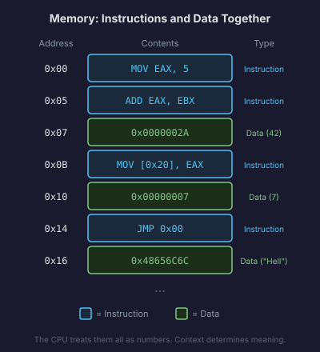
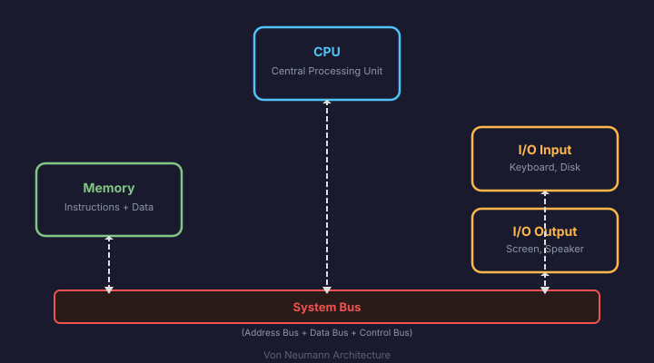
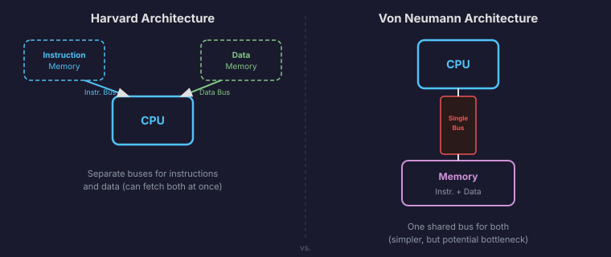
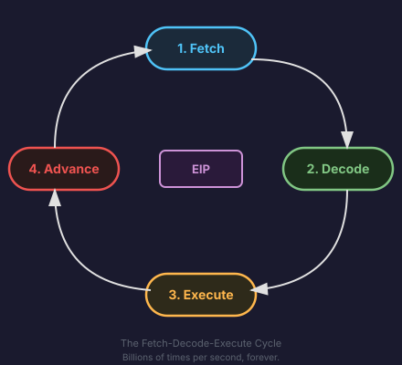

# What Is a Computer, Really?

What is a computer? Not the laptop sitting in front of you. Not the operating system, not the browser, not the apps. Strip all of that away. What is left?

At its core, a computer is a machine that does exactly one thing: it follows instructions. That is it. Every video you have ever watched, every game you have ever played, every message you have ever sent, all of it boils down to a machine reading instructions from memory and executing them, one after another, billions of times per second.

The entire point of this book is to understand that machine. Not as a user. Not even as a programmer. As a builder. We are going to write an operating system from scratch, and to do that, we need to understand the hardware it runs on. So let's start at the very bottom.

## The Stored-Program Concept

Here is an idea that changed everything about computing, and it is so simple that it might not seem like a big deal at first.

Before the 1940s, "programming" a machine meant physically rewiring it. You wanted the machine to do a different calculation? You rearranged cables and flipped switches. The program was the physical configuration of the hardware. Changing the program meant changing the machine.

Then came an insight that sounds almost too obvious in hindsight: **what if the instructions were just data?** What if, instead of wiring the program into the machine, you stored the program in the same memory where you stored the data it works on? Then changing the program would be as simple as loading different numbers into memory.

This is the **stored-program concept**. Instructions and data live together in the same memory. The computer reads an instruction from memory, executes it, reads the next one, executes that, and so on. The program is not baked into the hardware. It is just another sequence of numbers sitting in memory, waiting to be read.

Think of it like a recipe book that the cook can rewrite while cooking. The cook (the CPU) reads a step, does what it says, then moves to the next step. But some of those steps might say "cross out step 7 and write a new one." The recipe itself is just ink on paper, and the cook can change it. That is the stored-program concept. The program is not sacred. It is data.

This one idea is the reason you can run a web browser, a text editor, and a game on the same machine without rewiring anything between them. You just load different instructions into memory.

## The Von Neumann Architecture

The stored-program concept needed a machine design to make it real. In 1945, John von Neumann described an architecture that has become the template for nearly every computer built since. It has four components:

1. **The CPU (Central Processing Unit)**: The part that actually executes instructions. It reads an instruction, figures out what it means, does the operation, and moves on to the next one.

2. **Memory**: A large storage area that holds both the program (instructions) and the data the program works on. Every location in memory has an address, like a numbered mailbox.

3. **Input/Output (I/O)**: Everything the computer uses to talk to the outside world. The keyboard, the screen, the disk, the network card. These are all I/O devices.

4. **The Bus**: The set of wires connecting the CPU, memory, and I/O devices. When the CPU needs to read an instruction from memory, the request travels over the bus. When the CPU wants to send a character to the screen, that travels over the bus too.

That is the entire machine. CPU, memory, I/O, and a bus connecting them. Everything else you see on a modern computer, the operating system, the filesystem, the graphical interface, all of it is software built on top of these four pieces.

The key property of von Neumann's design is that instructions and data share the same memory and the same bus. The CPU does not care whether the number it just fetched from memory is an instruction to execute or a piece of data to work with. It is all just numbers. The CPU treats whatever it reads from the "next instruction" location as an instruction, and whatever an instruction tells it to read from elsewhere as data.

This has a powerful consequence: a program can modify itself. It can write new instructions into memory, then execute them. It also has a dangerous consequence: if a bug causes the CPU to start reading data as if it were instructions, it will happily try to execute garbage. We will see both sides of this throughout the book.

## Harvard vs. Von Neumann

There is an alternative design called the **Harvard architecture**, where instructions and data live in completely separate memories with separate buses. The original Harvard Mark I computer used this approach in the 1940s.

Why would you want separate memories? Speed. If instructions and data have their own buses, the CPU can fetch the next instruction and read data at the same time, instead of taking turns on a single shared bus.

Modern CPUs actually blur this line. They use a von Neumann design at the big-picture level: your program's instructions and data all live in the same RAM. But internally, the CPU keeps separate caches for instructions and data. The **instruction cache** (L1i) holds recently used instructions. The **data cache** (L1d) holds recently used data. So at the cache level, it looks like a Harvard architecture, but at the memory level, it is pure von Neumann.

You do not need to worry about this distinction deeply right now. It will come back later when we talk about CPU caches and performance. For now, just know that Anton's computer (and virtually every x86 machine) follows the von Neumann model: one memory, one address space, instructions and data mixed together.

## What "Running a Program" Actually Means

Let's bring this down to the most concrete level possible. What does it mean to "run a program" on a von Neumann machine?

It means this, over and over, forever:

1. **Fetch**: The CPU looks at a special internal register called the **instruction pointer** (or program counter). This register holds the address of the next instruction. The CPU sends that address to memory over the bus and gets back the instruction stored there.

2. **Decode**: The CPU examines the instruction it just fetched. Instructions are just numbers, and different bit patterns mean different things. The CPU figures out what operation this instruction represents. Is it an addition? A memory read? A jump to a different location?

3. **Execute**: The CPU performs the operation. If it is an addition, it adds two numbers. If it is a memory read, it fetches data from the specified address. If it is a jump, it changes the instruction pointer to point somewhere else.

4. **Advance**: Unless the instruction was a jump, the instruction pointer moves forward to the address of the next instruction. Then we go back to step 1.

This cycle, **fetch, decode, execute**, is the heartbeat of every program that has ever run on every computer you have ever used. A modern CPU might perform this cycle billions of times per second, and it might have tricks to overlap and reorder these steps for performance, but the fundamental idea has not changed since von Neumann described it.

When you press the power button on your computer and Anton boots up, the CPU starts this cycle. It fetches the first instruction from a fixed starting address, executes it, fetches the next one, and just keeps going. Every single thing the operating system does, from printing text to switching between programs to reading from a disk, happens because the CPU is executing instructions from memory, one after another.

That is a computer. A machine that reads instructions from memory and follows them. Simple in principle. Extraordinarily powerful in practice.

In the next section, we will go one level deeper and look at how this machine is built from the ground up, starting with the most basic component: the transistor.
