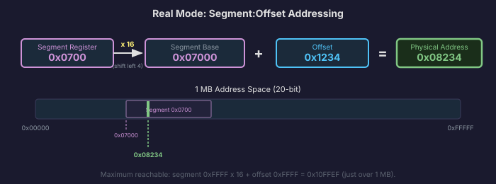
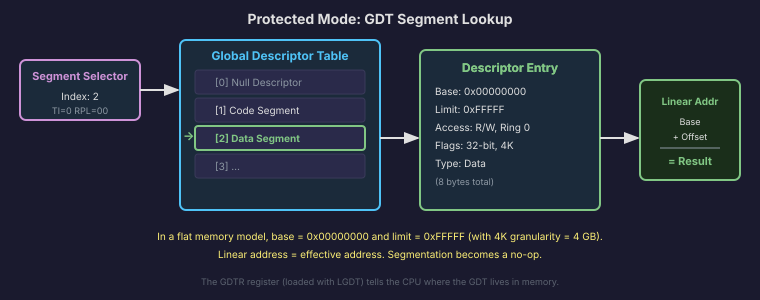
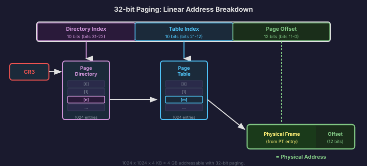
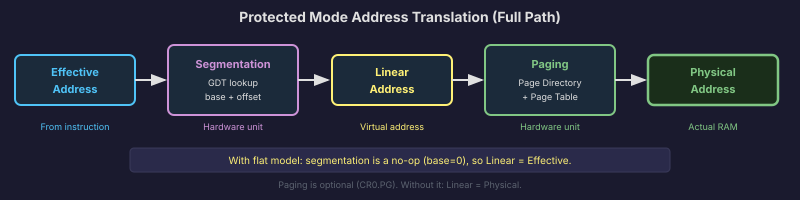

# x86 Memory Addressing

In Chapter 1, we said memory is a giant array of bytes and an address is just an index into that array. That is the mental model, and it is correct at the physical level. But between the address your program uses and the physical byte in RAM, the x86 CPU can insert several layers of translation. Which layers are active depends on which mode the CPU is in.

This section covers how memory addressing actually works on x86, from the simplest (real mode) to the more involved (protected mode with segmentation and paging). By the end, you will understand the path an address takes from your instruction to the physical memory chip.

## Real Mode: Segment:Offset Addressing

When the CPU first powers on, it starts in **real mode**. This is the 16-bit mode inherited from the original 8086, and it is where our bootloader will run.

Here is the problem real mode was designed to solve. The 8086 had 16-bit registers, which can hold values from 0 to 65,535. That means a single register can address at most 64 KB of memory. But Intel wanted the 8086 to access 1 MB of memory. How do you address 1 MB with 16-bit registers?

The answer is **segment:offset addressing**. Instead of using one register for the address, you use two: a **segment** register and an **offset**. The physical address is calculated as:

```
physical address = segment * 16 + offset
```

The multiplication by 16 is the same as shifting the segment value left by 4 bits. So if the segment is `0x0700` and the offset is `0x1234`:

```
physical = 0x0700 * 16 + 0x1234
         = 0x07000 + 0x01234
         = 0x08234
```

The result is a 20-bit address, which can range from `0x00000` to `0xFFFFF`, covering exactly 1 MB.



The segment register provides the base, and the offset provides the position within that segment. Different segment registers are used for different purposes: `CS` for code (the CPU fetches instructions from `CS:EIP`), `DS` for data (most memory reads use `DS`), `SS` for the stack, and `ES` for extra data operations.

There are a few things about real mode addressing that trip people up:

**Overlapping segments.** The same physical address can be represented by many different segment:offset pairs. `0x0700:0x1234` and `0x0823:0x0004` both produce physical address `0x08234`. There is no "canonical" representation.

**No protection.** Any program can set any segment register to any value and access any physical address. There are no permission checks, no isolation between programs, and no way to prevent a buggy program from overwriting the operating system. This is why real mode is only used during boot. We get out of it as fast as possible.

**The 1 MB limit.** With 20 address bits, you can only access addresses from `0x00000` to `0xFFFFF`. Anything beyond 1 MB is unreachable in real mode. (There is a quirk called the A20 gate that we will deal with in the bootloader chapter, but conceptually, real mode is limited to 1 MB.)

## Protected Mode: Segmentation with the GDT

When we switch the CPU to **protected mode** by setting the `PE` bit in `CR0`, the meaning of segment registers changes completely. They stop being raw memory base addresses and become **selectors**: 16-bit indices into a table called the **Global Descriptor Table** (GDT).

Each entry in the GDT is an 8-byte **segment descriptor** that describes a region of memory. It contains:

- **Base address** (32 bits): The starting address of the segment in linear memory.
- **Limit** (20 bits): The size of the segment (in bytes or 4 KB pages, depending on a flag).
- **Access byte**: Flags that control permissions. Is this segment for code or data? Can ring 3 (user mode) access it? Is it read-only?
- **Flags**: The granularity bit (byte or page granularity), the size bit (16-bit or 32-bit segment).

When the CPU encounters a memory access in protected mode, it takes the segment selector from the appropriate segment register, uses it to look up the descriptor in the GDT, and computes the **linear address** as:

```
linear address = segment base (from GDT) + offset
```

The CPU also checks the access permissions. If code running in ring 3 tries to write to a read-only segment, or access a segment marked as ring 0 only, the CPU raises a General Protection Fault (#GP). This is the "protected" in protected mode: the hardware enforces access rules.

Now here is the practical reality. Modern operating systems, including Linux, Windows, and Anton, set up a **flat memory model**. This means every segment in the GDT has a base of 0 and a limit of `0xFFFFF` with page granularity (meaning the limit is effectively 4 GB). With every segment starting at address 0, the linear address is simply equal to the offset:

```
linear address = 0 + offset = offset
```

Segmentation becomes invisible. The offset you use in your code is the linear address. The GDT still has to exist (the CPU requires it), and we still need separate entries for code and data segments, and for kernel and user mode. But the actual address translation through segmentation is a no-op.

So why does segmentation exist if everyone configures it to do nothing? History. Intel built segmentation into the 286 and 386 as a memory protection mechanism. Then paging came along and did everything segmentation could do, but better. Operating systems adopted paging for memory management and configured segmentation to be flat. But x86 cannot disable segmentation. The best you can do is make it transparent, which is what we will do.



## Paging: Virtual to Physical

With a flat segmentation model, the linear address equals the offset in your instruction. But the linear address is not necessarily the physical address. If paging is enabled (by setting the `PG` bit in `CR0`), the CPU translates the linear address into a physical address through **page tables**.

Paging divides memory into fixed-size pages, typically 4 KB each. The CPU maintains a two-level (or more) hierarchy of tables:

1. The **page directory**, pointed to by `CR3`, contains 1,024 entries. Each entry points to a page table.
2. Each **page table** contains 1,024 entries. Each entry maps a 4 KB page of linear address space to a 4 KB frame of physical memory.

When the CPU needs to translate a linear address:

1. Bits 31-22 (the top 10 bits) index into the page directory to find the page table.
2. Bits 21-12 (the next 10 bits) index into the page table to find the physical frame.
3. Bits 11-0 (the bottom 12 bits) are the offset within the 4 KB page, passed through unchanged.

This is a brief preview. We will build the page tables from scratch in Phase 3 (Memory Management). For now, the key insight is that paging creates a layer of indirection between the addresses your code uses (linear/virtual addresses) and the addresses that actually appear on the memory bus (physical addresses). This indirection is what makes virtual memory, process isolation, and memory-mapped files possible.



## The Full Address Translation Path

Let's put it all together. When the CPU executes an instruction like `MOV EAX, [0x1000]`, here is the full path from instruction to physical memory, depending on the mode:

**Real mode:**
```
physical = DS * 16 + 0x1000
```
One step. Direct.

**Protected mode, paging disabled:**
```
linear = GDT[DS].base + 0x1000    (flat model: base is 0, so linear = 0x1000)
physical = linear                   (no paging, linear = physical)
```

**Protected mode, paging enabled:**
```
linear = GDT[DS].base + 0x1000    (flat model: linear = 0x1000)
physical = page_table_lookup(linear)  (could map to any physical address)
```

In Phases 1 and 2, we will be in the second case: protected mode with a flat GDT and no paging. Starting in Phase 3, we will enable paging and enter the third case.



## Effective Address Calculation

Regardless of the mode and the translation layers above, the CPU needs to compute the offset that goes into the segment:offset or flat-model calculation. This offset is called the **effective address**, and x86 has a flexible formula for computing it:

```
effective address = base + (index * scale) + displacement
```

Where:
- **base** is a register (any general-purpose register).
- **index** is a register (any general-purpose register except `ESP`).
- **scale** is 1, 2, 4, or 8.
- **displacement** is an immediate constant (8-bit or 32-bit).

Any of these components can be omitted. This flexibility lets you express a wide variety of memory access patterns in a single instruction. Let's look at some concrete examples.

### `[EBX]`

Just a base register. The effective address is the value in `EBX`. This is a simple pointer dereference: if `EBX` holds `0x1000`, you are reading from address `0x1000`.

### `[EBP - 4]`

Base register plus displacement. The effective address is `EBP - 4`. This is the standard way to access local variables on the stack. If `EBP` is `0xBFFF0010`, you are reading from `0xBFFF000C`.

### `[EAX + ECX*4]`

Base plus scaled index. If `EAX` points to the start of an array of 32-bit integers, and `ECX` is the index, then `EAX + ECX*4` gives you the address of the element at position `ECX`. The `*4` accounts for the fact that each integer is 4 bytes.

### `[EAX + ECX*4 + 8]`

Base plus scaled index plus displacement. Same as above, but with an 8-byte offset, perhaps skipping a header at the start of the array. This is the most complex form, and the CPU handles it in a single instruction.

### `[0x1000]`

Just a displacement, no registers. The effective address is the literal value `0x1000`. This is an absolute memory address, and it is how you access memory-mapped I/O locations like the VGA text buffer at `0xB8000`.

These addressing modes are encoded directly in the instruction's machine code (the ModR/M and SIB bytes we glimpsed in Chapter 1). The CPU's address generation unit computes the effective address in hardware, in a single cycle. You do not pay extra for using a complex addressing mode versus a simple one.

Understanding these modes matters because you will see them constantly in disassembly output and in the assembly code we write for the bootloader and interrupt handlers. When the C compiler generates `[EBP - 8]`, you know it is accessing a local variable. When you see `[EAX + ECX*4]`, you know it is indexing into an array. The addressing mode tells you what the code is doing.

In the next section, we will look at the instructions that use these addressing modes: the x86 instruction set.
