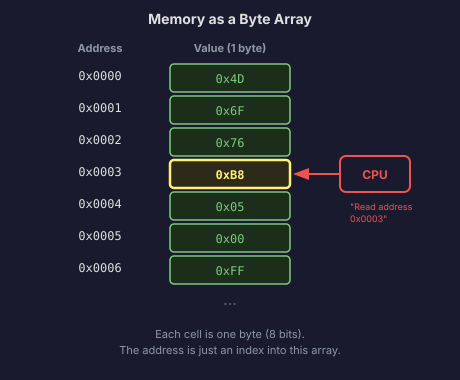
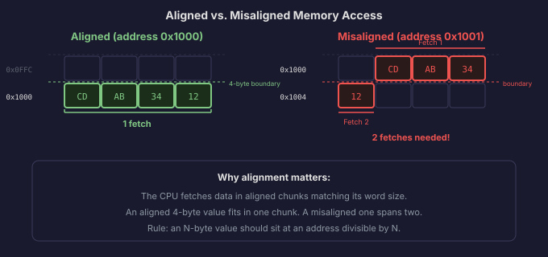
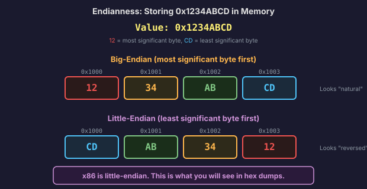
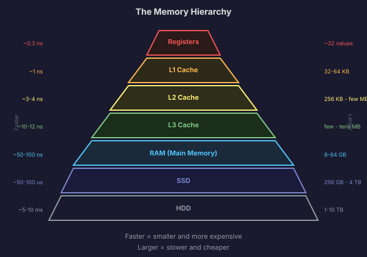

# Memory: The Giant Array

Everything we have covered so far, binary numbers, logic gates, arithmetic, all of it exists in the abstract until you ask: where do these numbers actually *live* inside the machine? The answer is memory. And the mental model for memory is simpler than you might expect.

**Memory is a giant array of bytes, starting at address 0.**

That is it. That is the core idea. Every byte in memory has a unique numeric address, just like every house on a street has a number. Address 0 holds the first byte. Address 1 holds the second. Address 1,000,000 holds the millionth. The CPU reads and writes to memory by specifying an address.

The rest of this section fills in the details around this model: how addresses work, what happens when data is larger than one byte, why the order of bytes within a multi-byte value matters, and the different kinds of memory your computer has.

## Addresses: Just Indices Into the Array

An **address** is a number that identifies a specific byte in memory. If memory is an array, the address is the index. When the CPU says "read the byte at address `0x1000`," it is asking for the 4,097th byte in memory (since we count from 0).

On a 32-bit system, addresses are 32 bits wide. A 32-bit number can hold values from 0 to 4,294,967,295 (that is 2^32 - 1), which means the CPU can address up to 4 GB of memory. Each address points to a single byte.

On a 64-bit system, addresses are 64 bits wide. In theory, that allows for 2^64 bytes of addressable memory, which is 16 exabytes. In practice, current hardware uses only 48 bits of the address (256 TB), which is still far more than anyone has installed.



When we start building Anton in 32-bit mode, we will work with 32-bit addresses. Every pointer in our kernel code will be 4 bytes wide. Later, when we transition to 64-bit mode in Phase 11, pointers become 8 bytes.

## Alignment

Consider a 32-bit integer. It occupies 4 bytes. You can store it starting at any address in memory, but the CPU prefers if you store it at an address that is a multiple of 4. Storing a 4-byte value at address `0x1000` (a multiple of 4) is **aligned**. Storing it at address `0x1001` (not a multiple of 4) is **misaligned**.

Why does the CPU care? Because of how the memory bus works. The CPU fetches data from memory in chunks that match its native word size. On a 32-bit system, it naturally fetches 4 bytes at a time, aligned to 4-byte boundaries. If your 4-byte integer straddles two of these natural boundaries, the CPU has to perform two separate fetches and stitch the results together. That is slower.

On x86, misaligned access works but incurs a performance penalty. On some other architectures (like ARM in certain modes), misaligned access triggers a hardware exception and crashes your program. Since we are targeting x86, we will not crash, but we will still align our data structures carefully because the performance difference adds up, especially in the kernel where every cycle counts.



The general rule: an N-byte value should be stored at an address that is a multiple of N. A 1-byte value can go anywhere. A 2-byte value should be at an even address. A 4-byte value at a multiple of 4. An 8-byte value at a multiple of 8. When we write C structs for hardware descriptors later in the book, alignment will be a constant consideration.

## Endianness: The Byte Order Debate

Here is a question that has started arguments among computer scientists for decades. If you have a 32-bit value like `0x1234ABCD` and you want to store it in memory starting at address `0x1000`, it takes up 4 bytes (addresses `0x1000` through `0x1003`). But in what order do you put the individual bytes?

There are two schools of thought.

**Big-endian** stores the **most significant byte first**. The "big end" of the number goes at the lowest address.

```
Address:  0x1000  0x1001  0x1002  0x1003
Value:      12      34      AB      CD
```

This looks natural to us because it matches how we write numbers on paper: the leftmost digit is the most significant.

**Little-endian** stores the **least significant byte first**. The "little end" of the number goes at the lowest address.

```
Address:  0x1000  0x1001  0x1002  0x1003
Value:      CD      AB      34      12
```

This looks backwards at first glance. But x86 processors are little-endian, and that is the world we live in for the entirety of this book.

Why would anyone design a system this way? Little-endian has a practical advantage: if you read a value from memory and then decide you only need the lower byte, it is always at the starting address, regardless of whether the full value is 16, 32, or 64 bits wide. You do not have to calculate an offset based on the value's size. This simplifies certain hardware operations.

The consequence for us is that when you examine memory in a debugger, multi-byte values will look "reversed" compared to how you write them in code. The value `0x1234ABCD` stored at address `0x1000` will show up in a hex dump as `CD AB 34 12`. This trips up every beginner at least once, and it will trip you up too. Just remember: x86 is little-endian. The least significant byte comes first in memory.



When we get to networking in Phase 10, endianness becomes a real issue because network protocols use big-endian byte order. The kernel will need functions to convert between the two.

## Volatile vs. Non-Volatile Memory

Not all memory is created equal. There is a fundamental divide between memory that forgets everything when you cut the power and memory that retains its contents.

**Volatile memory (RAM)** is the main working memory of the computer. "RAM" stands for Random Access Memory, meaning any byte can be read in roughly the same amount of time regardless of its address. RAM is fast, but it is temporary. The moment you lose power, everything in RAM is gone. This is the memory we have been talking about: the giant byte array where programs and data live while the computer is running.

**Non-volatile memory** retains data without power. This includes:

- **ROM (Read-Only Memory)**: Pre-programmed at the factory. The computer's BIOS firmware lives in ROM (or its modern variant, flash ROM). When you turn on the computer, the CPU starts by reading instructions from ROM, because RAM is empty at power-on.

- **Flash memory**: Used in SSDs, USB drives, and SD cards. Retains data without power, but can be rewritten (unlike traditional ROM). Slower than RAM, but much faster than spinning hard drives.

- **Hard disk drives (HDDs)**: Magnetic platters that spin at thousands of RPM. Data is stored as magnetic patterns on the surface. The slowest form of storage in common use, but cheap and high-capacity.

For building Anton, the distinction matters in a very concrete way: when the computer boots, RAM is empty. The BIOS firmware runs from ROM, initializes the hardware, loads the first 512 bytes of the disk into RAM, and jumps to it. That is the bootloader, and we will write it from scratch in Phase 1. The entire journey from power-on to a running operating system is the story of loading code from non-volatile storage into volatile memory so the CPU can execute it.

## The Memory Hierarchy

The CPU needs data to work with, and that data lives in memory. But not all memory is equally fast. In fact, there is a dramatic speed difference between the fastest memory (right inside the CPU) and the slowest (a spinning hard drive), spanning several orders of magnitude.

Think of it in terms of physical distance. If you need a book, the fastest way to get it is if it is already in your hands. A little slower if it is on your desk. Slower still if it is on a bookshelf across the room. Much slower if it is in a warehouse across town. And very slow if it is in a library in another country.

The memory hierarchy works the same way:

**Registers** are the fastest memory in the entire system. They live inside the CPU itself. A 32-bit x86 CPU has a handful of registers (we will cover them in detail in Chapter 2), each holding a single 32-bit value. Accessing a register takes about **1 clock cycle**, which at 3 GHz is roughly 0.3 nanoseconds. The CPU does its actual work here. Addition, comparison, logic, all of it happens between registers.

**L1 Cache** is a small, extremely fast memory bank built into the CPU, right next to the execution units. It typically holds 32 to 64 KB of recently accessed data and instructions. Access time is about **3 to 4 clock cycles** (roughly 1 nanosecond). When the CPU needs a byte from memory, it checks L1 first. Most of the time, the data is there.

**L2 Cache** is larger (256 KB to a few MB) but a bit slower, around **10 to 12 cycles** (3-4 nanoseconds). If L1 does not have the data, the CPU checks L2.

**L3 Cache** is larger still (several MB to tens of MB), shared among all CPU cores, and takes about **30 to 40 cycles** (10-12 nanoseconds). This is the last stop before going to main memory.

**RAM (Main Memory)** is the big array we keep talking about. Modern systems have 8 to 64 GB (or more). But accessing RAM takes about **100 to 200 cycles** (50-100 nanoseconds). Compared to a register access, that is 100 times slower.

**Disk (SSD or HDD)** is where files live. An SSD access takes about 50,000 to 100,000 nanoseconds (50-100 microseconds). A spinning hard drive is even worse: 5,000,000 to 10,000,000 nanoseconds (5-10 milliseconds) for a random read. Compared to a register, a hard drive is roughly **10 million times slower**.

Here is the same information in a table:

| Level     | Typical Size     | Access Time (approx.)  | Relative Speed  |
|-----------|------------------|------------------------|-----------------|
| Register  | ~32 values       | ~0.3 ns (1 cycle)     | 1x              |
| L1 Cache  | 32-64 KB         | ~1 ns (3-4 cycles)    | ~3x slower      |
| L2 Cache  | 256 KB - few MB  | ~3-4 ns (10-12 cycles)| ~10x slower     |
| L3 Cache  | few MB - tens MB | ~10-12 ns (30-40 cyc) | ~30x slower     |
| RAM       | 8-64 GB          | ~50-100 ns             | ~200x slower    |
| SSD       | 256 GB - 4 TB    | ~50,000-100,000 ns    | ~200,000x       |
| HDD       | 1-10 TB          | ~5,000,000-10,000,000 ns | ~20,000,000x |



The reason this hierarchy exists is a fundamental tradeoff: faster memory is more expensive and physically larger per bit. You cannot build 64 GB of memory that runs at register speed. It would be enormous and absurdly expensive. So the system uses a small amount of very fast memory close to the CPU, backed by progressively larger and slower layers.

The hardware manages most of this automatically. When the CPU accesses an address in RAM, the cache hardware copies not just that byte but an entire **cache line** (typically 64 bytes) into L1 cache, on the bet that the CPU will want nearby bytes soon. This bet usually pays off, because programs tend to access memory in patterns: sequential instructions, arrays traversed in order, stack variables used together. This principle is called **locality of reference**, and it is the reason caches work so well.

For kernel development, the memory hierarchy means two practical things. First, the way you lay out data structures in memory affects performance because of cache behavior. Second, certain operations that seem instant in high-level programming (like accessing a random element of a large array) can be surprisingly slow if the data is not in cache.

We will not worry about cache optimization yet. But having this mental model now helps you understand why the CPU has registers at all (because RAM is too slow for the CPU's inner loop), why caches exist (to bridge the speed gap), and why the kernel cares about memory layout.

In the next section, we will look at the CPU itself in much more detail: the fetch-decode-execute cycle, what machine code actually looks like, and the role of the instruction pointer that keeps the whole process moving forward.
