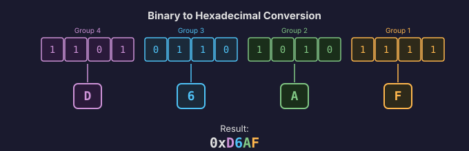
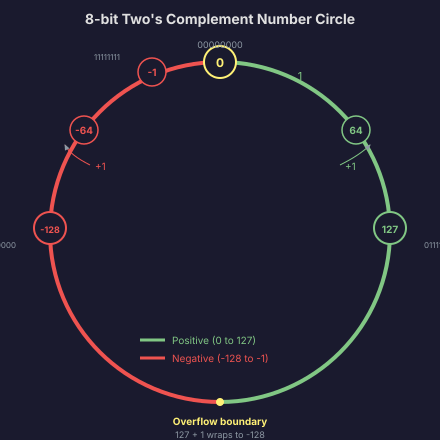
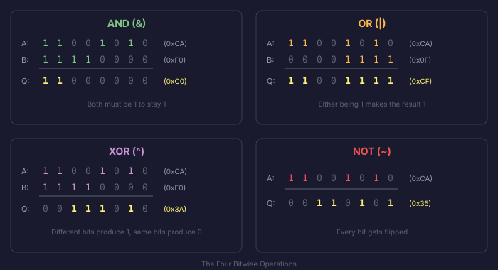
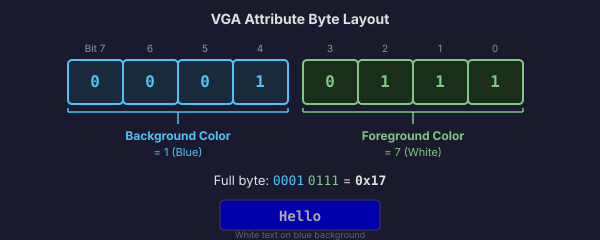

# Number Systems and Arithmetic

We established that computers work in binary. Every value inside the machine is a pattern of 0s and 1s. But as humans, staring at long strings like `11001010111011001101000011001101` is not exactly pleasant. We need better ways to read, write, and reason about these numbers.

This section covers the number systems you will use every day when writing an operating system: binary, hexadecimal, octal, and of course decimal. It also covers the arithmetic and bit manipulation operations that show up in nearly every line of kernel code.

## The Four Number Systems

### Decimal (Base 10)

You already know this one. We count in decimal every day: 0, 1, 2, 3, 4, 5, 6, 7, 8, 9, then we carry over and get 10. Each digit position represents a power of 10.

The number 2748 in decimal means:

```
2 * 1000  +  7 * 100  +  4 * 10  +  8 * 1
2 * 10^3  +  7 * 10^2 +  4 * 10^1 + 8 * 10^0
```

Simple enough. But computers do not think in powers of 10.

### Binary (Base 2)

Binary uses only two digits: 0 and 1. Each position represents a power of 2. Let's take the binary number `11010110`:

```
1*128 + 1*64 + 0*32 + 1*16 + 0*8 + 1*4 + 1*2 + 0*1
= 128 + 64 + 16 + 4 + 2
= 214
```

So `11010110` in binary is 214 in decimal.

Going the other way, to convert decimal to binary, you repeatedly divide by 2 and collect the remainders. Let's convert 214 back:

```
214 / 2 = 107  remainder 0
107 / 2 = 53   remainder 1
 53 / 2 = 26   remainder 1
 26 / 2 = 13   remainder 0
 13 / 2 = 6    remainder 1
  6 / 2 = 3    remainder 0
  3 / 2 = 1    remainder 1
  1 / 2 = 0    remainder 1
```

Reading the remainders bottom to top: `11010110`. We get back where we started.

Binary is the native language of the hardware, but writing out 32 binary digits every time you want to express a memory address is painful. That is where hexadecimal comes in.

### Hexadecimal (Base 16)

Hexadecimal, or just "hex," uses sixteen digits: 0 through 9, then A through F for the values 10 through 15. The critical property that makes hex so useful is this: **one hex digit represents exactly 4 bits**.

Here is the complete mapping:

| Hex | Decimal | Binary |
|-----|---------|--------|
| 0   | 0       | 0000   |
| 1   | 1       | 0001   |
| 2   | 2       | 0010   |
| 3   | 3       | 0011   |
| 4   | 4       | 0100   |
| 5   | 5       | 0101   |
| 6   | 6       | 0110   |
| 7   | 7       | 0111   |
| 8   | 8       | 1000   |
| 9   | 9       | 1001   |
| A   | 10      | 1010   |
| B   | 11      | 1011   |
| C   | 12      | 1100   |
| D   | 13      | 1101   |
| E   | 14      | 1110   |
| F   | 15      | 1111   |

This means converting between binary and hex is trivial. You just group the binary digits into chunks of 4 (starting from the right) and replace each chunk with its hex digit.

Take our earlier binary number `11010110`:

```
1101  0110
 D      6
```

So `11010110` in binary is `0xD6` in hex. The `0x` prefix is the standard way to indicate "this is a hexadecimal number" in C and most programming languages.



Two hex digits represent one byte (8 bits). Four hex digits represent a 16-bit value. Eight hex digits represent a 32-bit value. This is why you will see memory addresses written as things like `0xB8000` or `0x100000` throughout this book. It is vastly more readable than the binary equivalent, and converting between hex and binary is instant once you memorize that table (which you will, through sheer repetition).

### Octal (Base 8)

Octal uses digits 0 through 7. Each octal digit represents exactly 3 bits. You will encounter octal occasionally, most notably in Unix file permissions (where `755` means the owner can read, write, and execute, while everyone else can read and execute). But for OS development, hex is far more common. We will not dwell on octal, but you should know it exists and recognize it when you see it.

In C, an octal literal is written with a leading zero: `0755`. A hex literal uses `0x`: `0xFF`. A binary literal (in some compilers) uses `0b`: `0b11111111`. Knowing these prefixes keeps you from accidentally writing an octal number when you meant decimal.

## Binary Arithmetic

The CPU inside your computer performs arithmetic on binary numbers. Understanding how this works is not optional for OS development. You will need it for everything from setting up memory page tables to parsing hardware registers.

### Binary Addition

Binary addition follows the same rules as decimal addition, just with fewer digits. The rules for adding two single bits are:

```
0 + 0 = 0
0 + 1 = 1
1 + 0 = 1
1 + 1 = 10  (that is, 0 with a carry of 1)
```

Let's add two 8-bit numbers: `01101011` (107) and `00110101` (53):

```
  01101011   (107)
+ 00110101   ( 53)
----------
  10100000   (160)
```

You carry the 1 just like you do in decimal. Start from the rightmost bit, add the two bits and any carry from the previous column, write down the result, carry the overflow.

### Two's Complement: Representing Negative Numbers

Here is a problem. We have been talking about binary numbers as if they are always positive. But programs need negative numbers too. The CPU needs some way to represent -1, -42, -1000 using only patterns of 0s and 1s.

The system that virtually all modern computers use is called **two's complement**. Here is how it works.

For an N-bit number, the highest bit (the leftmost one) is the **sign bit**. If it is 0, the number is positive or zero. If it is 1, the number is negative.

But it is not as simple as "the sign bit is a minus sign." Two's complement has a specific encoding. To negate a number, you **flip all the bits and add 1**.

Let's see this with 8-bit numbers. The number 5 in binary is `00000101`. To get -5:

```
Step 1: Flip all bits:  11111010
Step 2: Add 1:          11111011
```

So -5 in 8-bit two's complement is `11111011`.

Let's verify: what is `11111011` as an unsigned number? It is 251. And what is 256 - 5? Also 251. That is the "two's complement" name: the negative of a number N in a system with 2^k possible values is 2^k - N.

Why does this system work so well? Because the CPU does not need separate addition and subtraction circuits. If you want to compute 10 - 5, you just compute 10 + (-5), which is regular binary addition of `00001010` and `11111011`:

```
  00001010   (10)
+ 11111011   (-5)
----------
  00000101   (5)
```

The carry out of the 8th bit is discarded, and you get 5. The same adder circuit handles both addition and subtraction.

Now let's look at something that confuses people at first. What is -1 in 8-bit two's complement?

```
1 in binary:   00000001
Flip all bits:  11111110
Add 1:          11111111
```

So -1 is `11111111`, which is `0xFF`. In 32 bits, -1 is `0xFFFFFFFF`. In 64 bits, -1 is `0xFFFFFFFFFFFFFFFF`. All bits set to 1. If you ever see a register full of `0xFF` values in a debugger, it might just be -1.

The range of an 8-bit two's complement number is -128 to 127. For 32 bits, it is -2,147,483,648 to 2,147,483,647. The positive range is one smaller than you might expect because zero takes up one of the positive slots.



**Overflow** happens when the result of an operation does not fit in the available bits. Adding 127 + 1 in 8-bit signed arithmetic gives you -128, not 128. The bits wrap around. This is not a bug in the hardware. It is a consequence of working with fixed-width numbers. The CPU sets a special **overflow flag** when this happens, and software can check it.

### Sign Extension

This is a detail that matters more than it looks. When you take a small signed number and put it into a larger register, you need to **sign-extend** it: copy the sign bit into all the new higher bits.

For example, -5 in 8-bit two's complement is `11111011`. If you put that into a 32-bit register, it becomes `11111111 11111111 11111111 11111011`, or `0xFFFFFFFB`. The sign bit (1) gets copied into all 24 new bits. If you just padded with zeros, you would get `0x000000FB`, which is 251, not -5. That would be wrong.

The x86 CPU has specific instructions for sign extension (`MOVSX`, `CBW`, `CWD`), and getting this wrong is a real source of kernel bugs. We will see it again when we start writing C for the kernel.

## Bitwise Operations

Now we get to the operations that you will use constantly in OS development. These operate on individual bits within a number, not on the number as a whole. If binary arithmetic is about treating a bit pattern as a number, bitwise operations are about treating it as a collection of individual flags or fields.

### Bitwise AND

AND compares each bit position independently. The result bit is 1 only if **both** input bits are 1.

```
  11001010
& 11110000
----------
  11000000
```

**When you use it**: Masking. If you want to extract just the upper 4 bits of a byte, you AND it with `0xF0`. The lower 4 bits get zeroed out, and the upper 4 bits pass through unchanged.

### Bitwise OR

OR compares each bit position independently. The result bit is 1 if **either** input bit is 1.

```
  11001010
| 00001111
----------
  11001111
```

**When you use it**: Setting bits. If you want to turn on specific bits without changing the others, you OR with a mask that has 1s in the positions you want to set.

### Bitwise XOR

XOR compares each bit position independently. The result bit is 1 if the inputs are **different**.

```
  11001010
^ 11110000
----------
  00111010
```

**When you use it**: Toggling bits. XOR flips the bits where the mask has 1s and leaves the others alone. It also has a neat property: XOR-ing a value with itself produces zero (`A ^ A = 0`), which is why you will see `XOR EAX, EAX` in assembly as a fast way to zero out a register.

### Bitwise NOT

NOT flips every bit. 0 becomes 1, 1 becomes 0.

```
~ 11001010
----------
  00110101
```

**When you use it**: Creating inverted masks, computing two's complement (flip all bits, then add 1).

### Left Shift

Left shift moves all bits to the left by a specified number of positions. New bits on the right are filled with 0. Bits that fall off the left are discarded.

```
11001010 << 2 = 00101000
```

**When you use it**: Multiplication by powers of 2. Shifting left by 1 is the same as multiplying by 2. Shifting left by N is multiplying by 2^N. This is much faster than actual multiplication on the CPU.

### Right Shift

Right shift moves all bits to the right. There are two kinds:

**Logical right shift** fills the new bits on the left with 0. This is used for unsigned numbers.

```
11001010 >> 2 = 00110010  (logical)
```

**Arithmetic right shift** fills the new bits with copies of the sign bit. This preserves the sign for negative numbers.

```
11001010 >> 2 = 11110010  (arithmetic, since the sign bit was 1)
```

**When you use it**: Division by powers of 2 (logical shift for unsigned, arithmetic shift for signed). Also very common for extracting bit fields from hardware registers.



## Bit Masks: The Kernel Programmer's Best Friend

A **mask** is a bit pattern used with AND, OR, or XOR to extract, set, or clear specific bits in a value. Masking is probably the single most common operation in kernel code.

### Extracting Bits

Suppose you have a 32-bit value from a hardware register, and bits 8 through 11 contain a 4-bit status code you need to read. How do you extract just those 4 bits?

```
Step 1: Shift right by 8 to bring the bits to position 0
        value >> 8

Step 2: AND with 0xF (which is 1111 in binary) to keep only the lowest 4 bits
        (value >> 8) & 0xF
```

That gives you the 4-bit status code as a number from 0 to 15. You will do variations of this operation hundreds of times when writing a kernel. Every hardware register packs multiple fields into a single value, and you always extract them the same way: shift and mask.

### Setting Bits

To set bit 5 of a value without touching any other bits:

```
value | (1 << 5)
```

The expression `1 << 5` produces a mask with only bit 5 set: `00100000`. OR-ing with this mask forces bit 5 to 1 and leaves everything else alone.

### Clearing Bits

To clear bit 5 of a value without touching any other bits:

```
value & ~(1 << 5)
```

`1 << 5` gives you `00100000`. NOT flips it to `11011111`. AND-ing with this mask forces bit 5 to 0 and leaves everything else alone.

### Checking a Bit

To check whether bit 5 is set:

```
if (value & (1 << 5)) {
    // bit 5 is set
}
```

If bit 5 is set, the AND produces a nonzero result. If bit 5 is clear, the AND produces zero.

### A Real Example: VGA Color Attributes

When we get to the VGA text driver in Phase 2, every character on screen is stored as 2 bytes: the character code and an **attribute byte**. The attribute byte packs the background color into the upper 4 bits and the foreground color into the lower 4 bits.

If you want to create an attribute byte for white text (color 7) on a blue background (color 1):

```
attribute = (1 << 4) | 7
          = 0x10 | 0x07
          = 0x17
```

If you later want to extract just the foreground color:

```
foreground = attribute & 0x0F    // gives 7
```

And the background color:

```
background = (attribute >> 4) & 0x0F    // gives 1
```



This is the rhythm of kernel programming: pack values into bit fields, extract them with shift-and-mask, set them with shift-and-OR. Learn this pattern now, because it never stops showing up.

In the next section, we will look at where all these numbers actually live: memory. We will build a mental model of memory as a giant array of bytes, understand how addresses work, and learn about the memory hierarchy that determines how fast the CPU can access any given piece of data.
