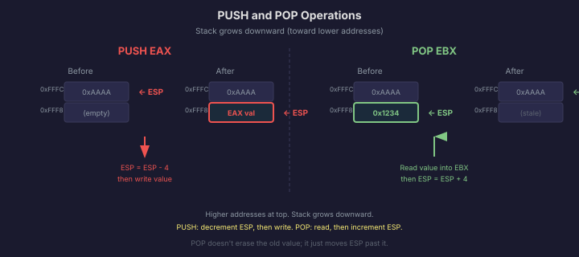
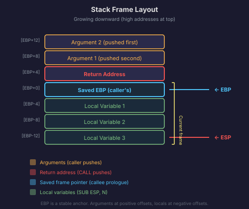
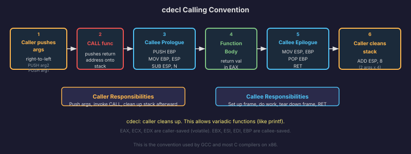

# The Call Stack

Every program you have ever used, from the simplest command-line tool to the most complex operating system kernel, calls functions. A function does some work, returns a result, and execution continues where it left off. This sounds simple, but think about what it requires: the CPU needs to remember where to return to after each function call, and it needs to give each function its own space for local variables without clobbering the caller's variables.

The mechanism that makes this work is the **call stack**, and understanding it is essential for OS development. The stack is where function arguments live, where return addresses are saved, where local variables are stored, and where the CPU saves its state when an interrupt fires. When something goes wrong in a program (a crash, a buffer overflow, a stack corruption), the stack is usually involved.

## What the Stack Is

The **stack** is a region of memory that operates as a Last In, First Out (LIFO) data structure. You push values onto the top, and you pop values off the top. The most recently pushed value is always the first one popped.

On x86, the stack grows **downward** in memory. This is a critical detail. When you push a value, the stack pointer decreases. When you pop a value, the stack pointer increases. The "top" of the stack is at a lower memory address than the "bottom."

The register `ESP` (Stack Pointer) always holds the address of the current top of the stack. It is the only register that `PUSH`, `POP`, `CALL`, and `RET` modify automatically.

Let's say `ESP` is `0xBFFF0020` and you push the value `0x12345678`:

1. `ESP` decreases by 4 (one doubleword): `ESP` is now `0xBFFF001C`.
2. The value `0x12345678` is written to the address `0xBFFF001C`.

Now the value sits at the top of the stack. If you pop:

1. The value at `[ESP]` (`0x12345678`) is read.
2. `ESP` increases by 4: `ESP` is back to `0xBFFF0020`.

The value is not erased from memory. It is still physically there at `0xBFFF001C`. But the stack pointer has moved past it, so it is logically no longer on the stack. The next push will overwrite it.

## `PUSH` and `POP` in Detail

```
PUSH EAX
```
This is equivalent to:
```
SUB ESP, 4            ; make room on the stack
MOV [ESP], EAX        ; write the value
```

```
POP EBX
```
This is equivalent to:
```
MOV EBX, [ESP]        ; read the value
ADD ESP, 4            ; shrink the stack
```

You can push and pop any general-purpose register, a memory location, or an immediate value. The operand is always 32 bits in 32-bit mode (4 bytes), so each push decreases `ESP` by 4 and each pop increases it by 4.



## `CALL` and `RET`: How Functions Work

When the CPU executes a `CALL` instruction, two things happen:

1. The address of the instruction immediately after the `CALL` (the **return address**) is pushed onto the stack. This is where execution should resume after the function returns.
2. `EIP` is set to the address of the called function. The CPU begins executing the function.

```
CALL my_function
; <-- this address gets pushed onto the stack as the return address
```

When the function is done and executes `RET`:

1. The value at `[ESP]` (the return address) is popped into `EIP`.
2. The CPU resumes execution at the return address.

That is the entire mechanism. `CALL` saves where to come back, `RET` goes back there. It is elegant in its simplicity.

But there is a critical consequence: if anything corrupts the return address on the stack (a buffer overflow, a stray write), `RET` will jump to whatever garbage value is there. This is the basis of return-oriented programming attacks and a huge category of security vulnerabilities. The stack is powerful, but it is also fragile.

## Stack Frames

When a function is called, it typically needs its own local variables. It might also receive arguments from the caller. The region of the stack that belongs to a particular function invocation is called a **stack frame**.

On x86, stack frames follow a consistent pattern called the **function prologue** and **epilogue**.

### The Prologue

At the start of a function:

```
PUSH EBP              ; save the caller's frame pointer
MOV EBP, ESP          ; set up our own frame pointer
SUB ESP, N            ; allocate N bytes for local variables
```

After the prologue, the stack looks like this (growing downward, lower addresses at the top):

```
        (lower addresses)
        |  local var 2   |  [EBP - 8]
        |  local var 1   |  [EBP - 4]
ESP --> |  (space)        |
        |  saved EBP      |  <-- EBP points here
        |  return address  |  [EBP + 4]
        |  argument 1      |  [EBP + 8]
        |  argument 2      |  [EBP + 12]
        (higher addresses)
```

The key insight: `EBP` stays fixed for the entire duration of the function. No matter how much the function pushes or pops (which changes `ESP`), `EBP` remains a stable anchor. Local variables are always at negative offsets from `EBP` (`[EBP - 4]`, `[EBP - 8]`, etc.), and function arguments are always at positive offsets (`[EBP + 8]`, `[EBP + 12]`, etc.).

Why is the first argument at `[EBP + 8]` instead of `[EBP + 4]`? Because `[EBP + 4]` holds the return address that `CALL` pushed, and `[EBP + 0]` holds the saved `EBP` from the prologue. The arguments start above those saved values.



### The Epilogue

When the function is done:

```
MOV ESP, EBP          ; discard local variables (restore ESP to frame base)
POP EBP               ; restore the caller's frame pointer
RET                   ; pop return address and jump back
```

This is sometimes written as a single instruction:

```
LEAVE                 ; equivalent to MOV ESP, EBP followed by POP EBP
RET
```

After the epilogue, the stack is exactly as it was before the function was called (except the caller still needs to clean up the arguments, depending on the calling convention).

## `EBP` as Frame Pointer: Why It Matters

You might wonder why we bother with `EBP` at all. Why not just use `ESP` to access local variables and arguments?

You can. In fact, optimizing compilers with `-fomit-frame-pointer` do exactly that. They track `ESP`'s value at compile time and compute the correct offsets. This frees up `EBP` for use as a general-purpose register, which can improve performance.

But there is a cost: without `EBP`, you cannot easily walk the stack at runtime. **Stack walking** means following the chain of saved `EBP` values to reconstruct the sequence of function calls that led to the current point. Each saved `EBP` points to the previous stack frame's `EBP`, forming a linked list from the current function all the way back to the first function.

This is how debuggers produce stack traces. It is also how the kernel can diagnose crashes: when a page fault or general protection fault occurs, the exception handler can walk the stack to report which functions were in the call chain. For a kernel, this is invaluable for debugging.

In Anton, we will keep the frame pointer for debug builds and critical kernel code. Performance-sensitive code can omit it later.

## Stack Overflow

The stack is allocated a fixed amount of memory. In a typical operating system, each thread gets a stack of a few kilobytes to a few megabytes. The stack starts at the top of this region and grows downward.

What happens when the stack grows beyond its allocated region? On a system with paging (which we will have after Phase 3), the page at the bottom of the stack region is typically left unmapped. When `ESP` decreases past the allocated region and the CPU tries to access the unmapped page, a **page fault** occurs. The operating system catches this and either expands the stack (if there is room) or kills the process with a stack overflow error.

Before we have paging, in the bootloader and early kernel, there is no safety net. If the stack grows too far, it will silently overwrite whatever is below it in memory. This can corrupt data, corrupt code, and produce baffling bugs. We will be careful to allocate a generous stack and avoid deep recursion in the early phases.

The classic causes of stack overflow are infinite recursion (a function that calls itself without a proper base case) and very large local variables (allocating a 1 MB array on the stack instead of using heap memory).

## The cdecl Calling Convention

A **calling convention** is a set of rules that the caller and the callee agree on. Who pushes the arguments? In what order? Who cleans them up afterward? Which registers can the function modify freely, and which must it preserve?

For 32-bit x86 C code, the default convention is **cdecl**. Here are the rules:

**Arguments**: Pushed onto the stack by the caller, right to left. So for `my_function(1, 2, 3)`:

```
PUSH 3                ; argument 3 (pushed first, ends up deepest)
PUSH 2                ; argument 2
PUSH 1                ; argument 1 (pushed last, closest to top)
CALL my_function
ADD ESP, 12           ; caller cleans up 3 arguments (3 * 4 bytes)
```

**Return value**: Placed in `EAX` by the callee. If the return type is 64 bits, the high 32 bits go in `EDX` and the low 32 bits in `EAX`.

**Caller-saved registers**: `EAX`, `ECX`, `EDX`. The callee may freely modify these. If the caller needs their values preserved, it must save them itself before the call.

**Callee-saved registers**: `EBX`, `ESI`, `EDI`, `EBP`. If the callee wants to use any of these, it must save them (push at the start) and restore them (pop at the end).

**Stack cleanup**: The caller is responsible for removing the arguments from the stack after the call (the `ADD ESP, 12` above). This is what distinguishes cdecl from other conventions like stdcall, where the callee cleans up.

Why does the caller clean up? Because it allows **variadic functions** (functions with a variable number of arguments, like `printf`). The callee does not know how many arguments were pushed, so it cannot clean them up. The caller, which pushed them, knows exactly how many there were.

When you write C code and compile it with GCC for 32-bit x86, the compiler generates code following cdecl. When you write assembly that calls C functions or is called from C, you must follow these rules manually. Getting them wrong corrupts the stack and produces crashes that are extremely difficult to debug.



In the next section, we will look at the hardware mechanism that separates kernel code from user code: the x86 privilege ring system.
