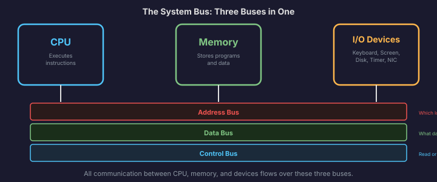
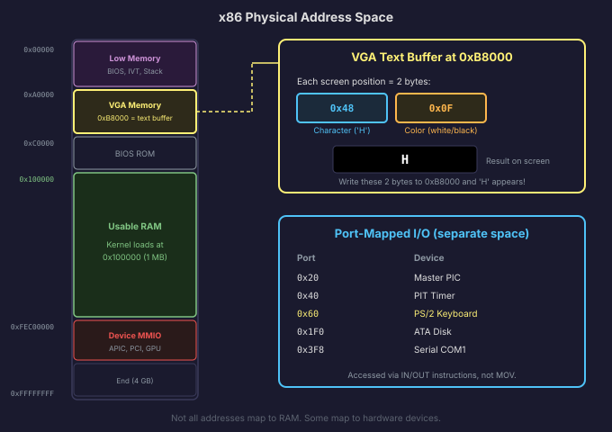

# The System Bus

We have the CPU. We have memory. We have I/O devices like the screen, the keyboard, and the disk. But none of these components exist in isolation. They need a way to talk to each other. That is what the **system bus** is: the set of electrical pathways that connects the CPU to everything else in the machine.

If the CPU is the brain and memory is the notebook, the bus is the nervous system. Every instruction the CPU fetches from memory, every value it reads or writes, every command it sends to a hardware device, all of it travels over the bus.

## The Three Buses

The system bus is actually three buses bundled together, each carrying a different kind of information:

### The Address Bus

The **address bus** carries the address of the memory location or I/O device the CPU wants to talk to. When the CPU wants to read the byte at address `0x1000`, it puts `0x1000` on the address bus. The memory controller sees this address and knows which byte to send back.

The width of the address bus determines how much memory the CPU can address. A 32-bit address bus can carry addresses from `0x00000000` to `0xFFFFFFFF`, which covers 4 GB. A 20-bit address bus (which is what the original 8086 had) can only address 1 MB. When we boot the CPU in real mode in Phase 1, we will be limited to 20 address lines and 1 MB of addressable memory. Switching to protected mode gives us the full 32-bit address bus.

### The Data Bus

The **data bus** carries the actual data being transferred. When the CPU reads from memory, the data comes back on the data bus. When the CPU writes to memory, the data goes out on the data bus.

The width of the data bus determines how many bytes the CPU can transfer in a single operation. A 32-bit data bus moves 4 bytes at a time. A 64-bit data bus moves 8 bytes. This is one reason why wider buses make the system faster: more data per transfer means fewer transfers needed.

### The Control Bus

The **control bus** carries signals that coordinate the whole operation. It tells memory and devices *what* the CPU wants to do: is this a read or a write? Is the CPU addressing memory or an I/O device? Is an interrupt being requested?

Some of the signals on the control bus include:

- **Read/Write**: Tells the memory whether the CPU wants to read data from an address or write data to an address.
- **Memory/IO**: Tells the system whether the address on the address bus refers to a memory location or an I/O port (more on this distinction below).
- **Interrupt lines**: Signals from hardware devices telling the CPU "I need attention." We will cover interrupts in depth in Chapter 8.
- **Clock signal**: The timing pulse that synchronizes all bus operations.

## How a Memory Read Works

Let's trace through what happens when the CPU executes an instruction that reads a value from memory, like `MOV EAX, [0x1000]` (read the 32-bit value at memory address `0x1000` into the EAX register):

1. The CPU puts the address `0x1000` on the **address bus**.
2. The CPU asserts "read" and "memory" on the **control bus**.
3. The memory controller sees the address and the read signal. It fetches the 4 bytes starting at address `0x1000` from RAM.
4. The memory controller puts those 4 bytes on the **data bus**.
5. The CPU reads the data from the data bus and loads it into EAX.

The whole transaction takes a fixed number of clock cycles (or a variable number, if the data has to come from main RAM rather than a cache). But from the CPU's perspective, it is a simple request-response: put an address out, ask for a read, get data back.

Writing works the same way, but in reverse: the CPU puts the address on the address bus, the data on the data bus, asserts "write" on the control bus, and the memory controller stores the data at the specified address.

## Memory-Mapped I/O

Here is where things get interesting. The CPU can talk to memory, but it also needs to talk to devices: the screen, the keyboard controller, the timer, the disk controller. How does it do that?

On x86, there are actually two different mechanisms, and understanding both is important for OS development.

The first mechanism is **memory-mapped I/O**. The idea is beautifully simple: certain address ranges in the physical address space are not connected to RAM. Instead, they are connected to hardware devices. When the CPU reads from or writes to one of these addresses, it is not accessing memory at all. It is communicating with a device.

The most vivid example, and the one you will use very early in this book, is the **VGA text buffer**. The physical address range starting at `0xB8000` is mapped to the VGA display hardware. This region is 4,000 bytes long (80 columns times 25 rows times 2 bytes per character). Each pair of bytes represents one character on screen: the first byte is the ASCII character code, the second byte is the color attribute.

If you write the byte `0x48` (the ASCII code for 'H') to address `0xB8000` and the byte `0x0F` (white on black) to address `0xB8001`, the letter 'H' appears in the top-left corner of the screen in white. You did not call a graphics library. You did not use a system call. You just wrote two bytes to a memory address, and the hardware turned them into a visible character.

This is what your kernel will do in Phase 2 to display text. No magic, no framework. Just writing to memory-mapped addresses.

Another example is the framebuffer. In Phase 9, when we switch to graphical mode, the display is mapped to a large block of physical memory. Each pixel is a value at a specific address. Writing a color value to that address changes the pixel on screen. The CPU does not even know it is "drawing." It is just writing to addresses. The display hardware interprets those addresses as pixels.

## Port-Mapped I/O

The second mechanism for talking to devices is **port-mapped I/O**, which is specific to the x86 architecture. In addition to the regular memory address space, x86 has a separate **I/O address space** of 65,536 ports (numbered 0 to 65,535). These ports are accessed with special instructions: `IN` (read from a port) and `OUT` (write to a port).

The I/O port space is completely separate from the memory address space. Port `0x60` is not the same thing as memory address `0x60`. They are different buses (or at least, different signals on the control bus tell the system which space is being accessed).

Many critical hardware devices on x86 are controlled through I/O ports. Here are some of the ports you will use when building Anton:

| Port Range     | Device                          |
|----------------|---------------------------------|
| `0x20-0x21`    | Master PIC (interrupt controller) |
| `0xA0-0xA1`    | Slave PIC (interrupt controller)  |
| `0x40-0x43`    | PIT (programmable timer)        |
| `0x60`, `0x64` | PS/2 keyboard controller        |
| `0x1F0-0x1F7`  | ATA primary disk controller     |
| `0x3D4-0x3D5`  | VGA cursor control              |
| `0x3F8`        | Serial port (COM1)              |

To read the scancode of a key that was just pressed on the keyboard, the kernel executes `IN AL, 0x60` (read one byte from port `0x60` into the AL register). To send a command to the interrupt controller, it executes `OUT 0x20, AL` (write the byte in AL to port `0x20`).

These `IN` and `OUT` instructions are **privileged**: they can only be executed by code running in kernel mode (ring 0). User-space programs cannot directly talk to hardware through I/O ports. This is an important part of the security model we will build in Phase 6.

## Why Both Mechanisms Exist

You might wonder why x86 has both memory-mapped I/O and port-mapped I/O instead of just one. The short answer is history.

The original Intel 8086 processor had a small memory address space (1 MB) and an even smaller set of I/O operations. Keeping I/O in a separate address space meant that the full memory space was available for actual memory. Devices got their own little namespace.

Over time, as address spaces grew (to 4 GB in 32-bit mode and far beyond in 64-bit), the pressure to save memory address space disappeared. Modern devices like PCIe cards, network adapters, and GPU framebuffers use memory-mapped I/O almost exclusively. But the legacy port-mapped devices (the PIC, the PIT, the PS/2 keyboard controller, the ATA disk interface) are still with us, because x86 is fanatically backward-compatible. The keyboard controller in your computer responds to port `0x60` just like it did in 1981.

For Anton, we will use both mechanisms. Memory-mapped I/O for the VGA display and eventually the framebuffer. Port-mapped I/O for the keyboard, timer, interrupt controller, disk controller, and serial port. Both are just ways for the CPU to exchange data with hardware, and both ultimately work through the bus system.

## How the CPU Talks to Hardware (Preview)

We have covered how data moves between the CPU and devices. But there is a question we have been avoiding: how does the CPU know *when* a device needs attention?

The keyboard does not constantly stream data. It sends a scancode only when a key is pressed. The disk does not have data ready at all times. It only has data after the CPU asked for it and the disk had time to read it. So how does the CPU find out that the keyboard has new input, or that the disk has finished reading a sector?

There are two approaches:

**Polling** means the CPU repeatedly checks the device: "Do you have data yet? No? How about now? Still no? What about now?" This works but wastes an enormous number of CPU cycles. Imagine standing at your mailbox, opening it every five seconds to check for mail.

**Interrupts** are the better approach. The device sends a signal to the CPU saying "I have something for you." The CPU stops what it is doing, handles the device's request, and then goes back to what it was doing. It is like a doorbell: you go about your life, and the doorbell rings when mail arrives.

Interrupts are how real operating systems work, and they are so important that we dedicate a large part of Chapter 8 to them. For now, just know that the bus includes interrupt request lines that devices use to get the CPU's attention, and that the CPU has dedicated hardware for responding to these signals.

## Wrapping Up Chapter 1

Let's look at where we have come. We started by asking "what is a computer, really?" and we arrived at a concrete answer:

A computer is a machine built from billions of transistors organized into logic gates. Those gates are combined into circuits that can add numbers, store bits, and route data. The CPU uses these circuits to execute the fetch-decode-execute cycle: read an instruction from memory, figure out what it means, carry it out, move on to the next one.

The CPU, memory, and I/O devices are connected by a bus system that carries addresses, data, and control signals. The CPU accesses devices through either memory-mapped addresses or dedicated I/O ports. Everything the computer does, from booting to running an operating system, is the CPU executing instructions from memory over this bus.

We have the foundation. In Chapter 2, we will zoom in on the specific CPU that Anton runs on: the x86 processor. We will learn about its registers, its memory addressing modes, its instruction set, and the privilege levels that separate kernel code from user code. That is where things start getting concrete enough to write actual code.
